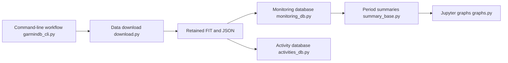

# tcgoetz/GarminDB

> Scripts Python qui téléchargent tes données de santé Garmin Connect et les rangent dans SQLite.

## Le problème
Les données Garmin restent dans Garmin Connect, difficiles à interroger et à analyser hors de l'appli.

## Ce que ça fait vraiment
Télécharge et importe fichiers de suivi quotidien (fréquence cardiaque, activité, stress), sommeil, poids, activités (laps, enregistrements), conserve les fichiers FIT et JSON pour reconstruire la base, produit des résumés quotidiens, hebdomadaires, mensuels, annuels, des graphiques et des exports TCX. Notebooks Jupyter fournis, plugins pour apps Connect IQ, import Fitbit et Microsoft Health.

## Comment c'est branché


## Essayer
```bash
pip install garmindb
garmindb_cli.py --all --download --import --analyze
garmindb_cli.py --all --download --import --analyze --latest
garmindb_cli.py --backup
```

## Coût et pièges
Il faut copier `GarminConnectConfig.json.example` vers `~/.GarminDb/` avec ton identifiant et mot de passe Garmin Connect en clair. Un changement de schéma impose `--rebuild_db`. Développé sous macOS.

## Ce que ce n'est pas
Pas un service officiel Garmin : il s'appuie sur Connect, dont l'accès peut casser. Licence GPL-2.0 (copyleft).

## Alternatives
Aucune alternative nommée dans le README (SQLite Studio, HeidiSQL, DB Browser cités pour parcourir la base).

## Pour toi
À adopter pour un projet de données perso : jeu de données personnel exploitable en pandas/Jupyter, projet ancien (2017) et actif.

