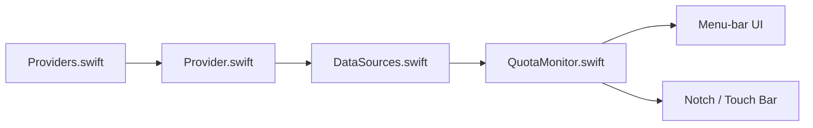

# tddworks/ClaudeBar

> Application macOS de barre de menus qui suit en temps réel les quotas d'assistants de code IA.

## Le problème
Les quotas (session 5 h, hebdomadaire) de Claude, Codex, Gemini, Copilot et autres sont dispersés et on les découvre épuisés.

## Ce que ça fait vraiment
Interroge chaque fournisseur activé (CLI, API ou base locale) et affiche des jauges colorées avec comptes à rebours, alertes de seuil et de rythme de consommation. Changement de compte, thèmes, widget Touch Bar, affichage dans le notch, extensions par scripts dans `~/.claudebar/extensions/`, publication optionnelle vers l'iPhone via Notify!.

## Comment c'est branché


## Essayer
```bash
brew install --cask claudebar
git clone https://github.com/tddworks/ClaudeBar.git
cd ClaudeBar
brew install tuist
tuist install
tuist build ClaudeBar -C Release
```

## Coût et pièges
macOS 15+ et Swift 6.2+ pour compiler. Certains modes lisent des cookies navigateur (Accès complet au disque) ou des jetons locaux. Notify! envoie noms de fournisseurs et pourcentages à un service tiers.

## Ce que ce n'est pas
Pas un outil de facturation ni d'optimisation de coût : il lit les quotas. Aucune licence déclarée : droits de réutilisation non établis.

## Alternatives
Aucune alternative nommée dans le README.

## Pour toi
À surveiller : pratique si tu jongles entre plusieurs abonnements d'assistants de code, mais l'absence de licence bloque toute réutilisation sérieuse.

