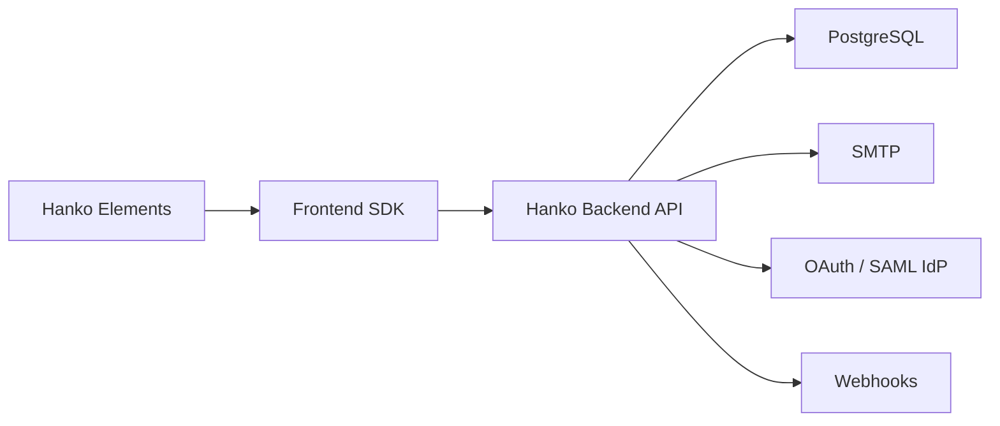

# teamhanko/hanko

> Solution open source d'authentification et de gestion d'utilisateurs, centrée sur les passkeys, pour développeurs d'applications web.

## Le problème
Construire une authentification sûre (mots de passe, MFA, passkeys, SSO) soi-même est long et sujet aux erreurs.

## Ce que ça fait vraiment
Un backend Go expose une API pour mots de passe, codes par e-mail, passkeys, OAuth, SAML, MFA (TOTP, clés de sécurité), sessions et webhooks, avec émission de JWT. Des composants web (Hanko Elements) et un SDK front (TypeScript) fournissent l'interface. PostgreSQL stocke les données ; Redis est optionnel. Disponible auto-hébergé ou en service géré (Hanko Cloud).

## Comment c'est branché

## Essayer
Le README ne fournit pas de commande : il renvoie à l'application de démarrage rapide et au fichier `quickstart.yaml` (Docker), sans commande détaillée. Aucune commande reprise.

## Coût et pièges
Le code est gratuit, mais le service géré est payant. Il faut PostgreSQL et un serveur SMTP. Licence présente mais non identifiée par GitHub, et la partie SAML est décrite comme édition entreprise.

## Ce que ce n'est pas
Pas un simple module de chiffrement : c'est un service à déployer. Organisations, rôles et permissions sont encore en cours.

## Alternatives
Aucune alternative nommée dans le README.

## Pour toi
À surveiller : intéressant pour ajouter des passkeys à une application ou un tableau de bord IA, après vérification de la licence ; pocket-id suffit si tu veux seulement un SSO.

