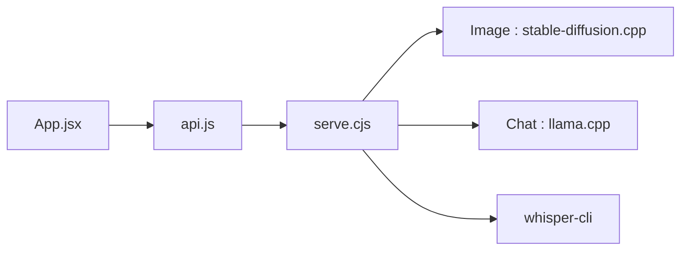

# techjarves/Portable-Local-Studio

> Studio local portable pour images Stable Diffusion, chat LLM, transcription Whisper et synthèse vocale Kokoro.

## Le problème
Installer séparément stable-diffusion.cpp, llama.cpp, whisper.cpp et un TTS, avec les bons backends GPU, est laborieux.

## Ce que ça fait vraiment
Un lanceur (`windows.bat`, `linux.sh`, `mac.sh`) télécharge un Node.js portable et les binaires adaptés (CUDA, ROCm, Vulkan, Metal, OpenVINO NPU). Interface React sur `localhost:1420` : génération d'images (SD 1.5, SDXL), chat GGUF, transcription, voix Kokoro, gestionnaire de modèles par URL Hugging Face, moniteur CPU/RAM/VRAM. Image et texte s'excluent par défaut pour ménager la mémoire.

## Comment c'est branché


## Essayer
```bash
chmod +x linux.sh
./linux.sh
./linux.sh --max-perf
./linux.sh --setup-openvino
```

## Coût et pièges
Gratuit, mais les poids de modèles pèsent plusieurs Go. Linux : glibc 2.38+ requis. macOS : Apple Silicon uniquement. Flux, LoRA et ControlNet ne sont pas gérés.

## Ce que ce n'est pas
Pas un outil de production ni un remplaçant de ComfyUI : modèles en fichier unique seulement. Le README affirme l'absence de télémétrie ; non vérifié ici.

## Alternatives
Aucune alternative nommée dans le README.

## Pour toi
À surveiller : pratique pour tester des modèles locaux sans installation, mais jeune (juin 2026) et limité en modèles supportés.

