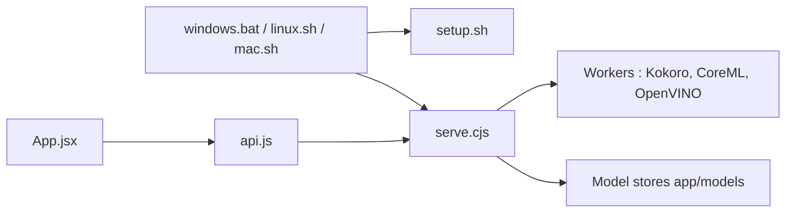

# techjarves/Uncensored-Local-Studio

> Studio local hors ligne regroupant génération d'images, chat LLM, transcription et synthèse vocale, sans compte ni cloud.

## Le problème
Assembler séparément stable-diffusion.cpp, llama.cpp, whisper.cpp et Kokoro, avec le bon backend GPU, demande beaucoup de configuration. Les services cloud imposent compte, abonnement et envoi des données.

## Ce que ça fait vraiment
- Une interface React (Vite) sert de simple tableau de commande ; `scripts/server/serve.cjs` démarre et arrête les moteurs natifs.
- Images via `stable-diffusion.cpp` (SD 1.5, SDXL), chat via serveur `llama.cpp` (GGUF), voix via `whisper-cli`, TTS via `kokoro-js`.
- Images et LLM sont mutuellement exclusifs par défaut pour ménager RAM et VRAM.
- Détecte le matériel : CUDA, ROCm, Vulkan, Metal, OpenVINO NPU ou CPU ; gestionnaire de modèles par URL Hugging Face.

## Comment c'est branché


## Essayer
```bash
chmod +x linux.sh
./linux.sh
./linux.sh --max-perf          # backend ROCm AMD
./linux.sh --setup-openvino    # NPU Intel
```
Puis ouvrir `http://localhost:1420`. Sous Windows : double-clic sur `windows.bat` ; sous macOS : `chmod +x mac.sh` puis `./mac.sh`.

## Coût et pièges
Gratuit, sans clé d'API, mais GPU conseillé (CPU très lent) et gros téléchargements (modèles de 2 à 6,6 Go). Linux : glibc 2.38+ requis ; macOS : Apple Silicon uniquement.

## Ce que ce n'est pas
Ni Flux, ni LoRA, ni ControlNet chargés seuls : non pris en charge. « Uncensored » désigne l'absence de filtre de l'application, pas des modèles : leur licence et l'usage légal du contenu généré restent à ta charge. Le README cite une licence MIT mais le catalogue ne la déclare pas.

## Alternatives
- leejet/stable-diffusion.cpp : le moteur d'images utilisé, si tu veux seulement la brique.
- llama.cpp et whisper.cpp : les moteurs directs, sans interface unifiée.

## Pour toi
Surveiller : pratique pour tester des modèles locaux en un seul lieu, mais projet d'une seule personne, licence à confirmer et peu d'intégration MLOps (pas d'API documentée).
