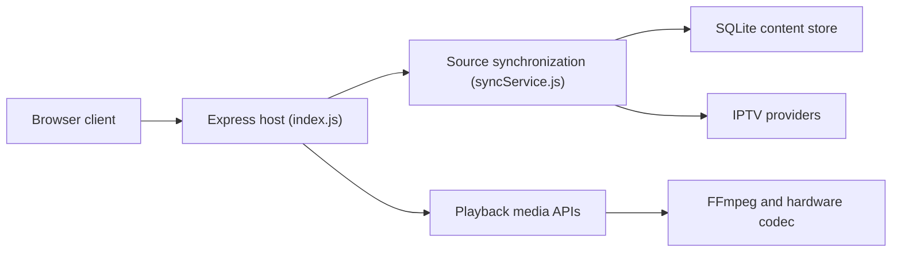

# technomancer702/nodecast-tv

> Lecteur IPTV web auto-hébergé (direct, guide des programmes, films, séries) avec transcodage matériel.

## Le problème
Regarder ses flux IPTV (Xtream Codes, M3U) demande souvent plusieurs applications selon l'appareil.

## Ce que ça fait vraiment
Serveur Node/Express avec SQLite, client JavaScript pur et HLS.js. Importe des sources Xtream ou M3U, un guide EPG XMLTV, des favoris, des rôles admin/spectateur et l'authentification OIDC. Transcodage FFmpeg avec NVENC, AMF, QuickSync, VAAPI, remux automatique, préréglages de mixage audio 5.1 vers stéréo. Un proxy contourne CORS et contenu mixte.

## Comment c'est branché


## Essayer
```bash
git clone https://github.com/technomancer702/nodecast-tv.git
cd nodecast-tv
npm install
npm run dev
docker-compose up -d
```
Puis http://localhost:3000.

## Coût et pièges
Gratuit, mais tu dois fournir un abonnement ou une source IPTV. Le transcodage matériel demande d'exposer le GPU au conteneur. Dernier push en mars 2026 (moins d'un an).

## Ce que ce n'est pas
Pas un fournisseur de contenu : aucune chaîne fournie. La légalité des sources dépend de toi.

## Alternatives
Aucune alternative nommée dans le README (Threadfin, xTeVe, dispatcharr sont des intergiciels compatibles).

## Pour toi
À ignorer : lecteur multimédia sans lien avec la donnée ou l'IA.

