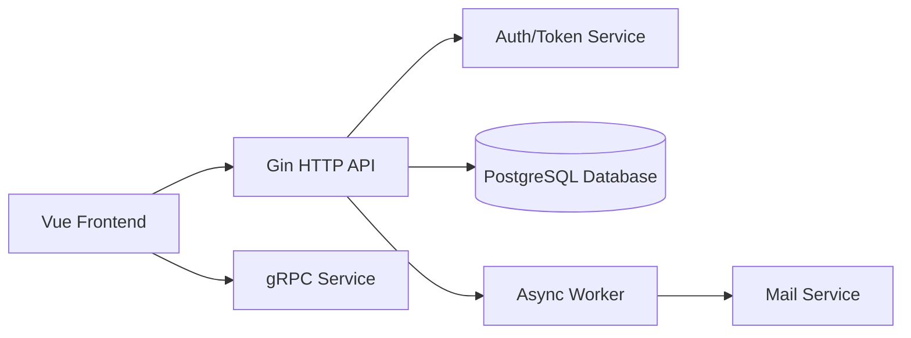

# techschool/simplebank

> Code du cours « Backend Master Class » : service bancaire en Go, de la base au déploiement EKS.

## Le problème
Apprendre le backend de bout en bout (transactions, auth, gRPC, déploiement) avec des tutoriels morcelés est difficile.

## Ce que ça fait vraiment
Un service de banque simple : comptes, écritures, virements dans une transaction SQL.
Couvre sqlc, migrations, Gin REST, JWT/PASETO, gRPC + gateway, workers Asynq/Redis, e-mails.
Déploiement Docker, AWS ECR/RDS/EKS, Ingress, Let's Encrypt, GitHub Actions.
Accompagne 77 leçons vidéo (Udemy) et un mini-cours Vue.js.

## Comment c'est branché


## Essayer
```bash
make network
make postgres
make createdb
make migrateup
make sqlc
make server
make test
```

## Coût et pièges
Gratuit en local ; le déploiement AWS EKS/RDS est facturé (une leçon y est consacrée).
Dernier push en avril 2025.

## Ce que ce n'est pas
Pas une bibliothèque ni un produit : matériel pédagogique.
Pas du Python ni de la data.

## Alternatives
Aucune alternative nommée dans le README.

## Pour toi
À ignorer pour la veille data/IA : excellent cours backend Go, mais hors de ton périmètre et plus mis à jour.
