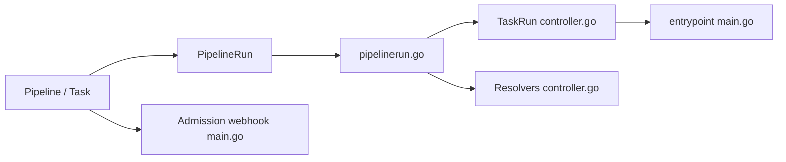

# tektoncd/pipeline

> Ressources Kubernetes pour déclarer et exécuter des pipelines CI/CD en conteneurs.

## Le problème
Les pipelines CI/CD dépendent d'un serveur de CI précis ; Tekton les exprime en ressources Kubernetes portables.

## Ce que ça fait vraiment
Définit `Task` et `Pipeline` ; un `PipelineRun` est réconcilié en `TaskRun` par le contrôleur, Kubernetes lance les conteneurs. Ajoute webhook d'admission, conversion d'API, résolveurs distants (Git…), événements cloud et identité SPIRE.

## Comment c'est branché

## Essayer
Aucune commande dans le README : il renvoie au guide d'installation et au tutoriel « Getting started ».

## Coût et pièges
Gratuit ; il faut un cluster Kubernetes dont la version minimale monte avec les versions de Tekton (1.28 pour la v0.61.x). Migrations v1alpha1, v1beta1, v1.

## Ce que ce n'est pas
Pas un serveur de CI clés en main : une couche de ressources à compléter (déclencheurs, interface), non décrite dans ce README.

## Alternatives
Aucune alternative nommée dans le README.

## Pour toi
À surveiller : pertinent si tes pipelines ML tournent déjà sur Kubernetes ; sinon trop lourd.

