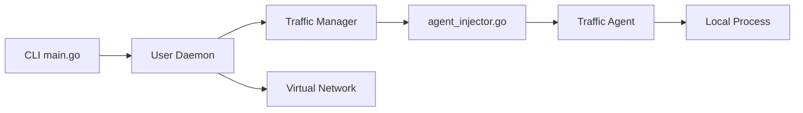

# telepresenceio/telepresence

> Outil CNCF qui connecte ton poste à un cluster Kubernetes pour développer en local.

## Le problème
Chaque modification d'un service impose le cycle build, push, deploy avant de tester face au vrai trafic du cluster.

## Ce que ça fait vraiment
Une interface réseau virtuelle : le poste résout le DNS et joint les IP du cluster.
Quatre modes : replace, intercept (filtrable par en-tête ou chemin), wiretap, ingest.
Un traffic-agent injecté en sidecar ou en node-agent (sans redémarrer les pods).
Le processus local tourne avec l'environnement et les volumes du conteneur distant.

## Comment c'est branché

## Essayer
Aucune commande documentée dans le README (renvoi vers le Quick Start).

## Coût et pièges
Il faut un cluster Kubernetes avec des droits pour déployer le traffic-manager.

## Ce que ce n'est pas
Pas un outil de déploiement ni de CI : rien n'est livré dans le cluster, on y branche seulement son poste le temps du développement. Et il faut un accès au cluster pour y injecter son agent.

## Alternatives
Aucune alternative nommée dans le README.

## Pour toi
À ignorer, sauf si tu développes des microservices sur Kubernetes au quotidien : c'est un outil de développeur plateforme, pas de data.
