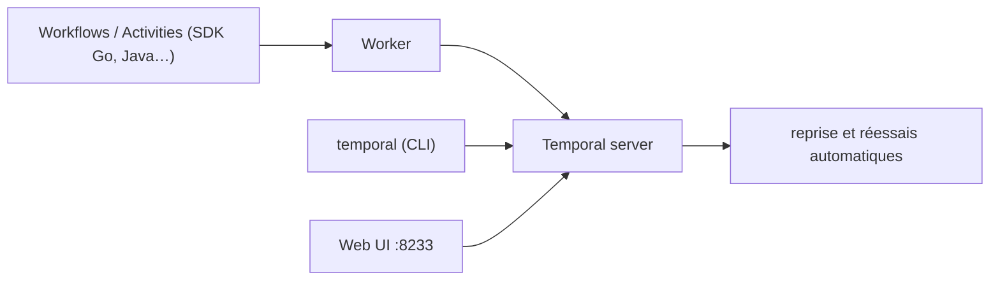

# temporalio/temporal

> Serveur d'exécution durable : il rejoue les workflows et réessaie les échecs à ta place.

## Le problème
Un traitement long qui appelle cinq services externes casse au milieu, et le code de reprise —
états, réessais, idempotence — finit par peser plus lourd que la logique métier.

## Ce que ça fait vraiment
Le serveur exécute des unités de logique applicative appelées Workflows, en gérant lui-même les
pannes intermittentes et en relançant les opérations échouées. Ce dépôt contient le code source du
serveur ; les Workflows, Activities et Workers s'écrivent dans l'un des langages supportés, via des
SDK séparés. Une CLI (`temporal`) interroge le serveur, une UI web est servie sur le port 8233.
Temporal est un fork de Cadence, développé par Temporal Technologies.

## Comment c'est branché


## Essayer
```bash
brew install temporal
temporal server start-dev
temporal operator namespace list
temporal workflow list
```

## Coût et pièges
`start-dev` est un mode de développement : rien dans ce README ne décrit une mise en production,
ni le stockage, ni le dimensionnement. Les jeux d'exemples diffèrent entre Go et Java, ce que le
README signale explicitement.

## Ce que ce n'est pas
Pas une bibliothèque : ce dépôt est le serveur, le code applicatif vit dans les SDK. Pas un
ordonnanceur de tâches cron ni une file de messages — c'est de l'exécution durable avec rejeu.
Pas documenté ici au-delà du démarrage local.

## Alternatives
- Cadence : le projet d'Uber dont Temporal est issu, nommé dans le README.

## Pour toi
La bonne fondation quand un pipeline doit survivre à des pannes ; à mettre en balance avec un simple ordonnanceur.
