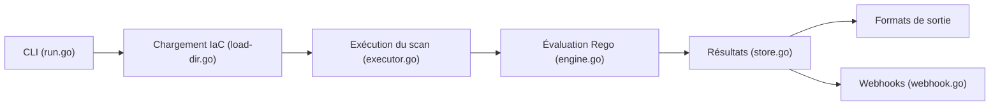

# tenable/terrascan

> Analyseur statique d'infrastructure-as-code détectant erreurs de configuration et violations de conformité ; archivé.

## Le problème
Des ressources cloud mal configurées sont déployées avant que quelqu'un ne le voie. Il faut les repérer dans le code, avant provisionnement.

## Ce que ça fait vraiment
Il analyse Terraform (HCL2), CloudFormation, ARM, Kubernetes (YAML/JSON, Helm v3, Kustomize) et Dockerfiles avec plus de 500 politiques écrites en Rego. Il sort un code de retour selon violations et erreurs, en formats humain, JSON, YAML ou XML. Il peut tourner en serveur API (admission Kubernetes, webhooks) et rattacher les vulnérabilités d'images de registres (ECR, ACR, GCR).

## Comment c'est branché


## Essayer
```bash
brew install terrascan
terrascan scan
docker run tenable/terrascan
```

## Coût et pièges
Gratuit. Les politiques sont téléchargées au premier scan (ou `terrascan init`). Le dépôt est archivé : plus de correctifs ni de nouvelles politiques.

## Ce que ce n'est pas
Pas maintenu : le README annonce lui-même qu'aucune mise à jour ni PR ne sera acceptée. Pas une solution de supervision en continu sans effort d'intégration.

## Alternatives
Non documenté dans le README : aucune alternative nommée.

## Pour toi
À ignorer pour un nouveau projet : l'archivage veut dire que les règles vieilliront ; choisis un scanneur IaC encore maintenu pour tes pipelines MLOps.

