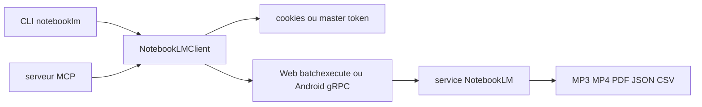

# teng-lin/notebooklm-py

> API Python et CLI non officielles pour piloter NotebookLM (Gemini Notebook) depuis un script ou un agent.

## Le problème
NotebookLM lit et synthétise tes sources, mais tout passe par des clics dans un navigateur.
Impossible d'y verser 30 documents, d'en ressortir les artefacts en lot, ou de le brancher sur un agent.

## Ce que ça fait vraiment
Couvre carnets, sources (URL, YouTube, PDF, Drive), chat cité, notes, étiquettes, recherche et partage.
Génère podcasts MP3, vidéos MP4, decks PDF/PPTX, quiz, flashcards, infographies, tableaux CSV, cartes mentales JSON.
Expose quatre surfaces : API Python asynchrone, CLI, serveur MCP (stdio ou HTTP distant), serveur REST local.
Trois modes d'authentification : Playwright interactif, cookies d'un navigateur déjà connecté, ou master token durable.

## Comment c'est branché


## Essayer
```bash
uv tool install "notebooklm-py[browser]"
notebooklm login
notebooklm auth check --test --json
notebooklm create "My Research"
notebooklm source add "./paper.pdf"
notebooklm ask "What are the key themes?"
notebooklm generate audio "make it engaging" --wait
```

## Coût et pièges
Le master token est un identifiant de compte complet et durable : le README recommande un compte dédié.
Les limites de sources et de carnets dépendent de ton palier Google ; l'usage intensif est susceptible d'être bridé.

## Ce que ce n'est pas
Pas un produit Google : il s'appuie sur des API internes non documentées qui peuvent casser sans préavis.
Pas un outil pour la production : le README le réserve aux prototypes, à la recherche et aux projets personnels.
Pas un moteur local : toute la synthèse se fait chez Google, ton corpus part chez eux.

## Alternatives
Aucune nommée dans le README.

## Pour toi
Astucieux pour déporter la lecture de gros corpus hors de ton budget jetons — à condition d'accepter le risque de casse.
