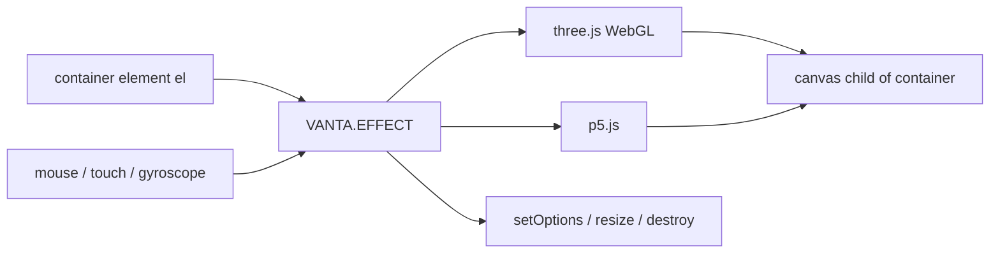

# tengbao/vanta

> **Animated 3D WebGL backgrounds** dropped into any HTML element, for front-end web pages.

## The problem

Dressing a page with an animated background usually means a background image or video, which
weighs more. The README puts a number on the alternative: about 120kb minified and gzipped in
total, three.js included, "smaller than comparable background images/videos".

## What it actually does

Vanta inserts an animated effect as a background into any HTML element. The canvas is appended
as a child of the container element and takes its width and height; the container's other
children stay in the foreground. Vanta does not render anything itself — rendering is done by
[three.js](https://github.com/mrdoob/three.js/) (using WebGL) or [p5.js](https://github.com/processing/p5.js),
depending on the effect. Effects can respond to mouse and touch input, and effect parameters
such as color can be modified. Several predefined effects ship with it (WAVES, BIRDS, TRUNK,
FOG, CLOUDS, CLOUDS2, TOPOLOGY are named in the README or its credits). The returned object
exposes `setOptions()`, `resize()` and `destroy()`.

## How it is wired



No code-derived diagram exists for this repo, so the graph above is rebuilt from the README.
Effects ship as separate files — `vanta.waves.min.js`, `vanta.birds.min.js`,
`vanta.trunk.min.js` under `dist/` — and only one is loaded at a time.

## Trying it

```html
<script src="https://cdnjs.cloudflare.com/ajax/libs/three.js/r134/three.min.js"></script>
<script src="https://cdn.jsdelivr.net/npm/vanta/dist/vanta.waves.min.js"></script>
<script>
  VANTA.WAVES('#my-background')
</script>
```

Via npm: `npm i vanta`, then `import BIRDS from 'vanta/dist/vanta.birds.min'`. For local dev
the README says: clone the repo, switch to the `gallery` branch, run `npm install` and
`npm run dev`, and go to localhost:8080.

## Cost and gotchas

Free, no API key, no account. The catch is the external dependency: `window.THREE` (or p5)
must be defined before init — the README repeats this in every example — otherwise you pass
the instance explicitly (`THREE: THREE`, `p5: p5`) imported from npm. The GPU and battery cost
of WebGL rendering is not documented here. You must call `destroy()` on unmount, or the effect
keeps running. `mouseControls` and `touchControls` default to true, `gyroControls` to false,
and these controls only apply to certain effects.

## What it is not

It is not a 3D engine: Vanta drives three.js or p5.js and exposes no scene of its own. It is
not a documented catalogue of tunable effects either — each effect has its own parameters,
which the README does not list, pointing to vantajs.com instead. And it is not a ready-made
React/Vue component: the README shows manual wiring through `ref`, `useEffect` /
`componentDidMount`, and explicit cleanup.

## Alternatives

- DavidHDev/react-bits — if you need a set of animated React components rather than a single
  3D background inserted into an element.
- aframevr/aframe — if you want a full declarative 3D/VR scene instead of a backdrop.
- three.js and p5.js, both named in the README, are the underlying layers: use them directly
  if you want control over rendering instead of consuming a predefined effect.

## Why it matters to you

Little relevance for a data / AI / MLOps profile in production. The plausible use is the shop
window: a demo page, a portfolio, a project landing page. Worth knowing, not worth adopting.
