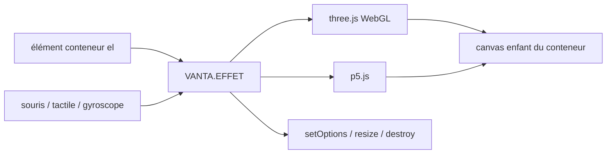

# tengbao/vanta

> **Fonds animés 3D en WebGL** insérés dans un élément HTML, pour front-end web, en quelques lignes.

## Le problème

Habiller une page d'un fond animé passe d'ordinaire par une image ou une vidéo de fond, plus
lourdes. Le README chiffre l'alternative : environ 120 ko minifiés et gzippés au total,
three.js compris, « plus petit que des images/vidéos de fond comparables ».

## Ce que ça fait vraiment

Vanta insère un effet animé comme arrière-plan dans n'importe quel élément HTML. Le canvas est
ajouté comme enfant du conteneur et en reprend la largeur et la hauteur ; les autres enfants du
conteneur restent au premier plan. Le rendu n'est pas fait par Vanta mais délégué à
[three.js](https://github.com/mrdoob/three.js/) (via WebGL) ou à [p5.js](https://github.com/processing/p5.js)
selon l'effet. Les effets réagissent aux entrées souris/tactile, et leurs paramètres (couleur,
par exemple) se modifient. Vanta fournit plusieurs effets prédéfinis (WAVES, BIRDS, TRUNK, FOG,
CLOUDS, CLOUDS2, TOPOLOGY sont cités dans le README ou ses crédits). L'objet retourné expose
`setOptions()`, `resize()` et `destroy()`.

## Comment c'est branché



Pas de diagramme tiré du code pour ce dépôt : le schéma ci-dessus est reconstruit depuis le
README. Les effets sont distribués en fichiers séparés — `vanta.waves.min.js`,
`vanta.birds.min.js`, `vanta.trunk.min.js` sous `dist/` — et on n'en charge qu'un.

## Essayer

```html
<script src="https://cdnjs.cloudflare.com/ajax/libs/three.js/r134/three.min.js"></script>
<script src="https://cdn.jsdelivr.net/npm/vanta/dist/vanta.waves.min.js"></script>
<script>
  VANTA.WAVES('#my-background')
</script>
```

Par npm : `npm i vanta`, puis `import BIRDS from 'vanta/dist/vanta.birds.min'`. Pour le dev
local, le README dit : cloner le dépôt, basculer sur la branche `gallery`, lancer
`npm install` et `npm run dev`, puis aller sur localhost:8080.

## Coût et pièges

Gratuit, pas de clé d'API, pas de compte. Le piège est la dépendance externe : `window.THREE`
(ou p5) doit être défini avant l'init — le README le répète à chaque exemple — sinon on passe
explicitement l'instance (`THREE: THREE`, `p5: p5`) importée depuis npm. Le rendu WebGL a un
coût GPU/batterie non documenté ici. Il faut appeler `destroy()` au démontage du composant,
sans quoi l'effet continue de tourner. `mouseControls`/`touchControls` sont à `true` par
défaut, `gyroControls` à `false`, et ces contrôles ne s'appliquent qu'à certains effets.

## Ce que ce n'est pas

Ce n'est pas un moteur 3D : Vanta ne rend rien lui-même, il pilote three.js ou p5.js et
n'expose pas de scène à soi. Ce n'est pas un catalogue exhaustif d'effets paramétrables à la
main : chaque effet a ses propres paramètres, que le README ne liste pas — il renvoie au site
vantajs.com. Ce n'est pas non plus un composant React/Vue prêt à l'emploi : le README montre
du câblage manuel par `ref`, `useEffect`/`componentDidMount` et nettoyage explicite.

## Alternatives

- DavidHDev/react-bits — si le besoin est un lot de composants React animés et non un fond 3D
  unique à insérer dans un élément.
- aframevr/aframe — si l'on veut une scène 3D/VR déclarative complète plutôt qu'un décor
  d'arrière-plan.
- three.js et p5.js, nommés dans le README, sont les couches sous-jacentes : les utiliser
  directement si l'on veut contrôler le rendu au lieu de consommer un effet prédéfini.

## Pour toi

Peu d'intérêt pour un profil data / IA / MLOps côté production. L'usage plausible est la
vitrine : page de démo, portfolio, landing d'un projet. À garder sous le coude, pas à adopter.
