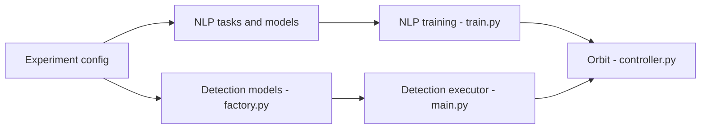

# tensorflow/models

> Collection d'implémentations de modèles TensorFlow 2 (officielles et de recherche) et bibliothèque Orbit, pour utilisateurs TF.

## Le problème
Retrouver des implémentations de référence, maintenues, de modèles état de l'art dans TensorFlow, avec une boucle d'entraînement réutilisable.

## Ce que ça fait vraiment
Quatre répertoires : `official` (modèles TF2 maintenus par l'équipe), `research` (code de chercheurs, TF1 ou 2), `community` (liste de dépôts) et `orbit` (boucles d'entraînement personnalisées compatibles `tf.distribute`, CPU/GPU/TPU). Le graphe montre NLP, vision/détection, recommandation, inférence Triton et BigQuery.

## Comment c'est branché


## Essayer
```bash
pip3 install tf-models-official
pip3 install tf-models-nightly
git clone https://github.com/tensorflow/models.git
export PYTHONPATH=$PYTHONPATH:/path/to/models
pip3 install --user -r models/official/requirements.txt
```

## Coût et pièges
Gratuit ; GPU/TPU conseillé pour entraîner. Le paquet stable peut être en retard sur `master` ; le nightly corrige cela mais bouge chaque jour. Pour le NLP, `tensorflow-text-nightly` est aussi requis.

## Ce que ce n'est pas
Pas un zoo de modèles pré-entraînés à télécharger : c'est du code d'implémentation. Le dossier `research` est maintenu par les chercheurs, sans garantie de mise à jour.

## Alternatives
Aucune alternative nommée dans le README.

## Pour toi
À surveiller : pertinent si ta pile est TensorFlow (Orbit, vision), mais la dynamique du secteur penche vers PyTorch et la licence est à confirmer.

