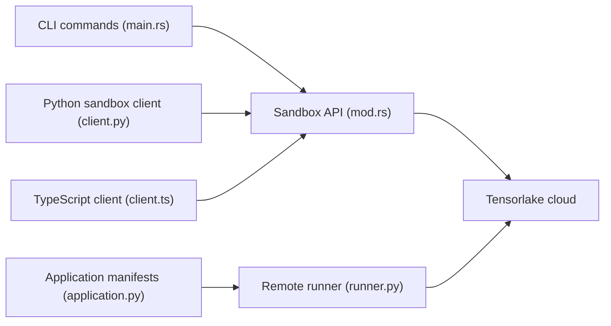

# tensorlakeai/tensorlake

> Plateforme cloud de sandboxes microVM et d'orchestration serverless pour agents qui exécutent du code généré.

## Le problème
Exécuter du code produit par un LLM sans l'isoler expose ton infrastructure ; il faut aussi pouvoir mettre en pause et reprendre l'état d'un agent.

## Ce que ça fait vraiment
SDK Python, TypeScript, Rust et CLI `tl` pour créer des sandboxes Firecracker, y lancer des commandes, copier des fichiers, snapshotter, mettre en pool et restreindre le réseau. Ajoute des volumes cloud versionnés et un runtime d'applications (@application, @function) déployées avec `tl deploy`. Les chiffres de benchmark viennent du README et ne sont pas vérifiés.

## Comment c'est branché


## Essayer
```bash
pip install tensorlake
curl -fsSL https://tensorlake.ai/install | sh
export TENSORLAKE_API_KEY="your-api-key"
tl login
tl sbx create
```

## Coût et pièges
Compte et clé obligatoires sur cloud.tensorlake.ai ; tarification non précisée dans le README. Images limitées aux Sandbox Images enregistrées (pas d'image Docker arbitraire). Le code d'exécution tourne chez eux.

## Ce que ce n'est pas
Pas un runtime local ni auto-hébergeable d'après le README. Le SDK est ouvert, mais la plateforme est un service hébergé.

## Alternatives
E2B, Modal, Daytona et Vercel, cités dans le README comme comparaison de performance.

## Pour toi
À surveiller : pertinent pour exécuter du code d'agent en sécurité, mais dépendance à un SaaS et benchmarks fournis par l'éditeur.

