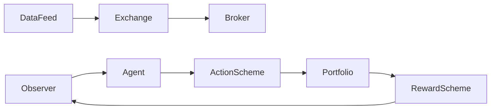

# tensortrade-org/tensortrade

> Framework Python pour entraîner et évaluer des agents d'apprentissage par renforcement en trading.

## Le problème
Monter un environnement de trading RL réaliste (ordres, portefeuille, commissions, récompenses) prend du temps et produit souvent des résultats biaisés.

## Ce que ça fait vraiment
Fournit un `TradingEnv` composable : Observer, ActionScheme (BSH), RewardScheme (PBR), Portfolio, Exchange simulé à commission configurable.
Scripts d'entraînement avec Ray RLlib et optimisation Optuna.
Le README publie honnêtement ses résultats : un PPO sur BTC/USD bat le buy-and-hold à 0 % de commission, perd à 0,1 %.
Tutoriels sur surapprentissage et validation walk-forward.

## Comment c'est branché


## Essayer
```bash
python3.12 -m venv tensortrade-env && source tensortrade-env/bin/activate
pip install -e .
pip install -r examples/requirements.txt
python examples/training/train_simple.py
pytest tests/tensortrade/unit -v
```

## Coût et pièges
Gratuit ; Python 3.11/3.12. Entraînement RLlib gourmand en CPU.
Les résultats montrent que les commissions effacent le gain : piège classique du backtest.

## Ce que ce n'est pas
Pas un bot de trading prêt à gagner de l'argent.
Pas un connecteur de courtier en production documenté dans le README.

## Alternatives
Aucune alternative nommée dans le README.

## Pour toi
À surveiller : bon terrain d'apprentissage RL appliqué avec des résultats honnêtes, mais sans valeur de production directe.
