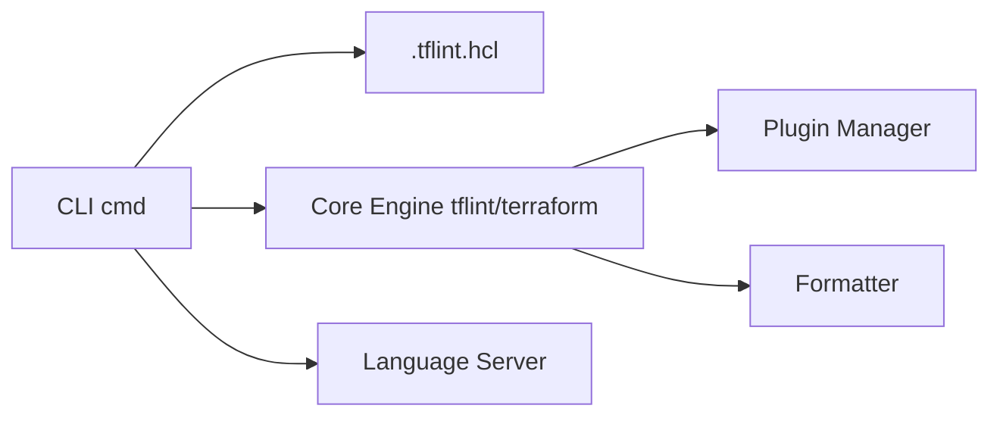

# terraform-linters/tflint

> Linter Terraform à plugins qui détecte erreurs, syntaxe obsolète et écarts de conventions.

## Le problème
`terraform validate` ne voit ni les types d'instances invalides, ni les déclarations inutilisées, ni les conventions d'équipe.

## Ce que ça fait vraiment
Moteur de lint où chaque règle vient d'un plugin ; ruleset Terraform inclus (preset « recommended »).
Plugins AWS, Azure, GCP installables via `tflint --init`, règles perso en plugin Go ou en Rego (OPA).
Sorties json, checkstyle, junit, sarif ; mode `--fix`, `--recursive`, serveur de langage.
Image Docker et action GitHub disponibles.

## Comment c'est branché


## Essayer
```bash
brew install terraform-linters/tap/tflint
go install github.com/terraform-linters/tflint@latest
docker run --rm -v $(pwd):/data -t ghcr.io/terraform-linters/tflint
TFLINT_LOG=debug tflint
```

## Coût et pièges
Gratuit ; les plugins cloud s'installent séparément. Licence MPL-2.0 (copyleft faible, par fichier).

## Ce que ce n'est pas
Pas un scanner de sécurité complet ni un validateur de plan : il lit le code, pas l'état déployé.

## Alternatives
Aucune alternative nommée dans le README.

## Pour toi
À adopter dans toute CI qui déploie de l'infra ML en Terraform : installation d'un binaire, gain immédiat sur les erreurs bêtes.
