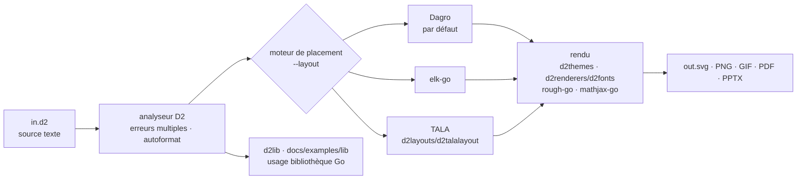

# terrastruct/d2

> **A scripting language that turns text into SVG diagrams you can version alongside code.**

## The problem

A diagram drawn with a mouse lives outside the repository: it has no readable diff, nobody
updates it, and code review never notices it has become a lie. Writing the diagram as text
fixes versioning, but you still need a language whose parser reports several errors at once,
an autoformatter, and a layout engine that does not collapse as the diagram grows.

## What it actually does

D2 is a command-line executable that reads a `.d2` file and produces an image. The language
describes nodes, nested containers (`network.cell tower.transmitter`), labelled edges, and
styling through attributes: `shape: cylinder`, `style.multiple`, `style.stroke-dash`,
`shape: person`. Global options go in a `vars.d2-config` block inside the source itself.

The `--watch` mode opens a browser window that live-reloads whenever the input file changes.
Advertised exports are SVG, PNG, GIF, PDF and PPTX. Official themes ship in `./d2themes`, the
default render font is "Source Sans Pro" and can be swapped via `./d2renderers/d2fonts`.

Three layout engines are bundled and selected with `--layout=dagre`, `--layout=elk` or
`--layout=tala`, or through the `D2_LAYOUT` variable: Dagro (a Go port of Dagre, the default,
layered layouts), elk-go (a Go port of ELK), and TALA (an in-house engine aimed at software
architecture diagrams, bundled but opt-in). Sequence diagrams and grids get dedicated
handling. Sketch rendering relies on rough-go, LaTeX labels on mathjax-go.

D2 can also be used as a Go library to produce diagrams from a program (examples under
`./docs/examples/lib`); the layout packages in `./d2layouts` or functions passed to `d2lib`
let you plug in your own algorithm.

## How it is wired



No code-derived diagram exists for this repository: this one is rebuilt from the README alone,
using the paths it cites (`./d2themes`, `./d2renderers/d2fonts`, `./d2layouts`, `d2lib`). The
point to keep is that engine selection is a command-line switch sitting between parsing and
rendering: the same source changes layout without being edited.

## Trying it

```sh
# First, install D2
curl -fsSL https://d2lang.com/install.sh | sh -s --

echo 'x -> y -> z' > in.d2
d2 --watch in.d2 out.svg
```

From source, if Go is installed (the README notes you then get no manpage):

```sh
go install github.com/d2lang/d2@latest
```

The install script accepts `--dry-run` to print the commands without running them, and
`--uninstall` to remove it:

```sh
curl -fsSL https://d2lang.com/install.sh | sh -s -- --uninstall
```

To list layout engines and their options: `d2 layout`, then `d2 layout <name>`.

## Cost and traps

- **Free, no account, no key.** The README states D2 uses no internet connection after
  installation, except to check for version updates from GitHub periodically, and that it
  collects no telemetry. It needs no browser to render and can run entirely server-side.
- **MPL-2.0 licence**, declared in the License section and in `./LICENSE.txt`: file-level
  copyleft. The catalogue itself records no licence for this repository (`—`), nor stars nor
  language — hence the two alerts kept: verify on the repository before embedding it in a
  closed product.
- **Installation via `curl | sh`** is the recommended path. The README owns this, documents how
  the script works to allay concerns, and **itself recommends using your OS package manager**
  instead for better security.
- **Name mismatch**: the repository is catalogued as `terrastruct/d2`, while the whole README
  (badges, `go install`, official plugins) points to `d2lang/d2`. Account for that in install
  scripts and pinned URLs.
- **The language has to be learned**: the nested-attribute syntax matches no other diagram
  tool, and the README sends language documentation to a separate site and repository
  (`d2lang.com`, `d2lang/d2-docs`).

## What it is not

- **Not a graphical editor.** You write text; `--watch` only previews and reloads. The online
  playground is for trying things out, not for drawing.
- **Not Mermaid, and not a superset of an existing syntax**: a diagram base written elsewhere
  will not be reused as is. The README points to a comparison site (`text-to-diagram.com`)
  rather than promising compatibility.
- **Not a code-to-diagram generator.** D2 renders what you write; extracting a schema from
  Postgres, Mongo, ent or Structurizr goes through third-party community plugins, listed in the
  README but not maintained by the project.
- **Not a documentation tool**: no generated site, no navigation. The MkDocs, mdBook, VitePress
  and Pandoc integrations are again separate projects whose upkeep the README does not
  guarantee.
- **The advertised language tooling is not complete**: the README presents the autoformatter and
  syntax highlighting as done, but LSPs as "plans".

## Alternatives

No comparable alternative in the catalogue: the lot line offers no authorised neighbours for
this repository (column `—`), and the only repositories the README names are its own components
or extensions, not competitors. For the record, and to avoid confusion:

| | What it really is |
|---|---|
| **d2lang/dagro**, **d2lang/elk-go** | Layout engines *bundled inside* D2, not rivals: switching between them is just `--layout`. |
| **d2lang/d2-vscode**, **d2-vim**, **d2-obsidian** | Official editing extensions: they complement D2, they do not replace it. |
| **d2lang/text-to-diagram-site** | The comparison site against other text-to-diagram tools, published by the project itself: that is where a real head-to-head lives, not in this README. |

## For you

Useful as soon as a data / MLOps repository has to show a processing chain to humans: a `.d2`
file reads in a diff, regenerates in CI, and replaces the stale screenshot on the wiki. Library
use from Go is the real differentiator if you generate diagrams from an inventory (services,
tables, DAGs) rather than by hand. Skip it if the team already renders diagrams inside an
existing documentation pipeline: the cost is not the install, it is one more language to learn
for a purely visual gain.
