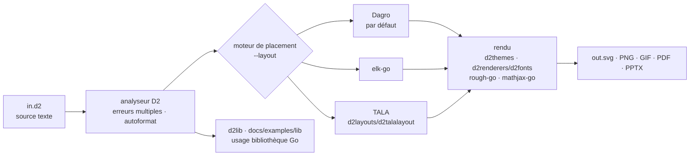

# terrastruct/d2

> **Un langage de script qui transforme du texte en diagrammes SVG, versionnables avec le code.**

## Le problème

Un diagramme d'architecture dessiné à la souris vit en dehors du dépôt : il n'a pas de diff
lisible, personne ne le met à jour, et la revue de code ne voit jamais qu'il ment. Écrire le
diagramme en texte règle le versionnement, mais encore faut-il un langage dont l'analyseur
signale plusieurs erreurs à la fois, un formateur automatique et un moteur de placement qui
ne se noie pas dès que le schéma grossit.

## Ce que ça fait vraiment

D2 est un exécutable en ligne de commande qui lit un fichier `.d2` et produit une image. Le
langage décrit des nœuds, des conteneurs imbriqués (`network.cell tower.transmitter`), des
arêtes étiquetées, et un style par attributs : `shape: cylinder`, `style.multiple`,
`style.stroke-dash`, `shape: person`. Les options globales passent par un bloc `vars.d2-config`
dans la source même.

Le mode `--watch` ouvre une fenêtre de navigateur qui se recharge à chaque modification du
fichier d'entrée. Les exports annoncés sont SVG, PNG, GIF, PDF et PPTX. Des thèmes officiels
sont livrés dans `./d2themes`, la police de rendu par défaut est « Source Sans Pro » et se
remplace via `./d2renderers/d2fonts`.

Trois moteurs de placement sont embarqués et se choisissent avec `--layout=dagre`,
`--layout=elk` ou `--layout=tala`, ou par la variable `D2_LAYOUT` : Dagro (port Go de Dagre,
par défaut, disposition hiérarchique), elk-go (port Go d'ELK) et TALA (moteur maison orienté
architecture logicielle, embarqué mais à activer). Les diagrammes de séquence et les grilles
ont leur traitement propre. Le rendu « sketch » s'appuie sur rough-go, les étiquettes LaTeX
sur mathjax-go.

D2 s'utilise aussi comme bibliothèque Go pour générer des diagrammes depuis un programme
(exemples dans `./docs/examples/lib`), et les paquets de placement de `./d2layouts` ou les
fonctions passées à `d2lib` permettent de brancher son propre algorithme.

## Comment c'est branché



Aucun diagramme tiré du code n'existe pour ce dépôt : ce schéma est reconstruit depuis le seul
README, à partir des chemins qu'il cite (`./d2themes`, `./d2renderers/d2fonts`, `./d2layouts`,
`d2lib`). Le point à retenir est que le choix du moteur est un commutateur en ligne de commande
placé entre l'analyse et le rendu : la même source change de disposition sans être modifiée.

## Essayer

```sh
# First, install D2
curl -fsSL https://d2lang.com/install.sh | sh -s --

echo 'x -> y -> z' > in.d2
d2 --watch in.d2 out.svg
```

Depuis les sources, si Go est installé (le README précise qu'on n'obtient alors pas la page de
manuel) :

```sh
go install github.com/d2lang/d2@latest
```

Le script d'installation accepte `--dry-run` pour afficher les commandes sans les exécuter, et
`--uninstall` pour désinstaller :

```sh
curl -fsSL https://d2lang.com/install.sh | sh -s -- --uninstall
```

Pour lister les moteurs de placement et leurs options : `d2 layout`, puis `d2 layout <name>`.

## Coût et pièges

- **Gratuit, sans compte ni clé.** Le README indique que D2 n'utilise pas de connexion réseau
  après installation, sauf pour vérifier périodiquement les nouvelles versions auprès de
  GitHub, et qu'il ne collecte pas de télémétrie. D2 n'a pas besoin de navigateur pour rendre :
  il tourne entièrement côté serveur.
- **Licence MPL-2.0**, annoncée dans la section License et dans `./LICENSE.txt` : copyleft de
  fichier. Le catalogue, lui, ne relève aucune licence pour ce dépôt (`—`), pas plus que les
  étoiles ou le langage — d'où les deux alertes conservées : à vérifier sur le dépôt avant
  intégration dans un produit fermé.
- **Installation par `curl | sh`** dans le chemin recommandé. Le README l'assume, documente le
  fonctionnement du script pour lever les inquiétudes, et **recommande lui-même de passer plutôt
  par le gestionnaire de paquets de son système** pour la sécurité.
- **Décalage de nom** : le dépôt est catalogué sous `terrastruct/d2`, mais tout le README
  (badges, `go install`, plugins officiels) pointe vers `d2lang/d2`. À prendre en compte dans
  les scripts d'installation et les URL épinglées.
- **Le langage est à apprendre** : la syntaxe d'attributs imbriqués n'est celle d'aucun autre
  outil de diagramme, et le README renvoie la documentation du langage à un site et un dépôt
  séparés (`d2lang.com`, `d2lang/d2-docs`).

## Ce que ce n'est pas

- **Ce n'est pas un éditeur graphique.** On écrit du texte ; `--watch` ne fait que prévisualiser
  et recharger. Le playground en ligne sert d'essai, pas d'outil de dessin.
- **Ce n'est pas Mermaid ni un sur-ensemble de la syntaxe existante** : une base de diagrammes
  écrite ailleurs ne se réutilise pas telle quelle. Le README renvoie à un site de comparaison
  (`text-to-diagram.com`) plutôt que de promettre une compatibilité.
- **Ce n'est pas un générateur de diagrammes depuis le code.** D2 rend ce qu'on lui écrit ;
  extraire un schéma d'une base Postgres, de Mongo, d'ent ou de Structurizr passe par des
  plugins communautaires tiers, listés dans le README mais non maintenus par le projet.
- **Ce n'est pas un outil de documentation** : pas de site généré, pas de navigation. Les
  intégrations MkDocs, mdBook, VitePress, Hugo-like et les filtres Pandoc sont, là encore, des
  projets séparés dont le README ne garantit pas le suivi.
- **Le langage tooling annoncé n'est pas complet** : le README parle de l'autoformateur et de la
  coloration comme faits, mais des LSP comme de « plans ».

## Alternatives

Aucune alternative comparable dans le catalogue : la ligne du lot ne propose aucun voisin
autorisé pour ce dépôt (colonne `—`), et les seuls dépôts nommés par le README sont ses propres
composants ou ses extensions, pas des concurrents. Pour mémoire, et pour éviter la confusion :

| | Ce que c'est en réalité |
|---|---|
| **d2lang/dagro**, **d2lang/elk-go** | Moteurs de placement *embarqués dans* D2, pas des outils rivaux : les remplacer revient à changer `--layout`. |
| **d2lang/d2-vscode**, **d2-vim**, **d2-obsidian** | Extensions officielles d'édition : elles complètent D2, elles ne s'y substituent pas. |
| **d2lang/text-to-diagram-site** | Le site de comparaison avec les autres outils texte-vers-diagramme, publié par le projet lui-même : c'est là qu'il faut aller chercher une vraie mise en concurrence, pas dans ce README. |

## Pour toi

Utile dès qu'un dépôt data / MLOps doit montrer une chaîne de traitement à des humains :
un `.d2` se relit en diff, se régénère en CI et remplace la capture d'écran périmée du wiki.
L'usage comme bibliothèque Go est le vrai différenciateur si tu génères des schémas à partir
d'un inventaire (services, tables, DAG) plutôt qu'à la main. À écarter en revanche si l'équipe
rend déjà ses schémas dans un pipeline de documentation existant : le coût n'est pas
l'installation, c'est un langage de plus à apprendre pour un gain purement visuel.
