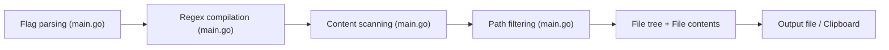

# tesserato/CodeWeaver

> CLI Go qui transforme un répertoire de code en un seul document Markdown pour partage ou LLM.

## Le problème
Donner à un LLM l'ensemble d'une base de code oblige à copier des fichiers un par un.

## Ce que ça fait vraiment
Parcourt un répertoire, filtre les chemins par expressions régulières (include, ignore), écrit l'arbre des fichiers puis leur contenu dans des blocs de code Markdown. Peut enregistrer les listes de chemins inclus et exclus et copier le résultat dans le presse-papiers.

## Comment c'est branché


## Essayer
```bash
go install github.com/tesserato/CodeWeaver@latest
codeweaver
codeweaver -input=my_project -output=project_docs.md
codeweaver -include="\.go$,\.md$" -ignore="vendor,test"
```

## Coût et pièges
Gratuit. Le Markdown produit peut dépasser la fenêtre de contexte d'un modèle ; filtrer finement. Ne protège pas les secrets présents dans les fichiers inclus.

## Ce que ce n'est pas
Pas un outil de documentation générée ni de résumé : il concatène du contenu brut, sans analyse.

## Alternatives
RepoMix, gitingest, code2prompt, files-to-prompt, yek, parmi une longue liste citée dans le README.

## Pour toi
À surveiller : correct mais très concurrencé ; préfère files-to-prompt ou RepoMix si tu veux une solution plus répandue.

