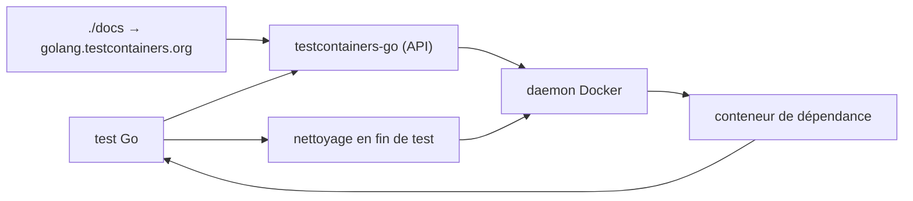

# testcontainers/testcontainers-go

> Bibliothèque Go pour lancer et nettoyer des dépendances en conteneurs dans les tests d'intégration.

## Le problème
Tester du code Go contre une vraie base ou un vrai broker oblige soit à monter un docker-compose à
côté, soit à mocker — et à nettoyer à la main ce qui reste après un test qui plante.

## Ce que ça fait vraiment
Permet de définir par programme, en Go, les conteneurs qui doivent tourner dans le cadre d'un test,
puis libère ces ressources quand le test est terminé. C'est tout ce que dit le README, qui renvoie
au site `golang.testcontainers.org`, rendu depuis le dossier `./docs` du dépôt, et au guide de
démarrage pour ajouter la dépendance au projet.

## Comment c'est branché

## Essayer
Aucune commande documentée dans le README : il renvoie au guide de démarrage rapide pour ajouter la
dépendance au projet Go.

## Coût et pièges
Gratuit. Il faut un daemon Docker accessible depuis l'environnement de test, ce qui déplace le
problème en CI (socket monté, ou Docker-in-Docker). Le temps de démarrage des conteneurs s'ajoute à
chaque exécution de la suite.

## Ce que ce n'est pas
Pas un outil de test : ça ne remplace ni `go test` ni les assertions, ça fournit les dépendances.
Pas documenté dans le dépôt : le README fait moins de 800 caractères et tout le contenu utile est
hors dépôt, donc rien de vérifiable ici — fiche minimale.

## Alternatives
Aucune alternative nommée dans le README.

## Pour toi
Pertinent seulement si tu écris du Go ; l'équivalent Python du même projet est le vrai sujet.
