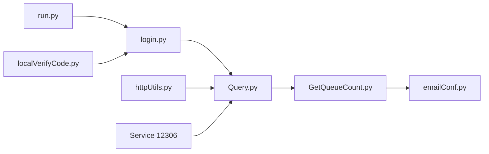

# testerSunshine/12306

> Assistant Python d'achat automatique de billets de train sur 12306, pour utilisateurs chinois.

## Le problème
Obtenir un billet sur un site saturé en période de pointe, où les places partent en quelques secondes.

## Ce que ça fait vraiment
Se connecte au compte 12306, interroge la disponibilité en boucle, soumet la commande, suit la file d'attente et notifie par e-mail ou ServerChan. Gère la liste d'attente intelligente et la reconnaissance automatique des captchas (modèle local à télécharger ou serveur distant). Le README est en chinois.

## Comment c'est branché


## Essayer
```bash
pip3 install -i https://pypi.tuna.tsinghua.edu.cn/simple -r requirements.txt
python3 run.py t
python3 run.py c
python3 run.py r
docker-compose up --build -d
```

## Coût et pièges
Compte 12306 requis, modèle de captcha à télécharger (lien Baidu). Le README signale que 12306 bloque les IP de serveurs : à lancer depuis chez soi. Testé avec Python 3.6 à 3.7.4.

## Ce que ce n'est pas
Pas une garantie de billet : le README dit que le programme ne fait qu'accélérer l'achat. Dépôt archivé depuis avril 2023, donc l'API de 12306 a pu changer.

## Alternatives
Aucune alternative nommée dans le README.

## Pour toi
Ignorer : archivé, sans mise à jour depuis 2023 et lié à un service chinois précis ; son seul intérêt est de lire un exemple de bot de réservation.

