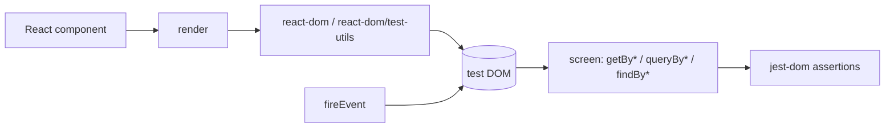

# testing-library/react-testing-library

> **One sentence.** Testing utilities for React components that go through the rendered DOM instead of component instances.

## The problem

As the README frames it: you want maintainable tests for your React components, tests that
avoid including implementation details, so that refactors — changes to implementation but not
to functionality — don't break your tests and slow you and your team down.

## What it actually does

It adds utility functions on top of `react-dom` and `react-dom/test-utils`: `render` to mount a
component, `screen` with its queries (`getByText`, `queryByText`, `getByLabelText`, `findByRole`
and so on), and `fireEvent` to trigger interactions. `query*` functions return the element or
`null`; `get*` functions return the element or throw. Queries accept a regular expression, which
the README notes makes selectors more resilient to content tweaks. The stated guiding principle
is "the more your tests resemble the way your software is used, the more confidence they can
give you", and the inclusion rules are spelled out: deal with DOM nodes rather than component
instances, stay useful for a single component as well as a full application. Assertions are not
part of it — `toBeInTheDocument()` and `toHaveTextContent()` come from the separate
`@testing-library/jest-dom` package.

## How it is wired



No code-derived diagram exists for this repository; this one is rebuilt from the README.
`@testing-library/dom` must be installed separately starting with version 16, and `react`,
`react-dom` and `@testing-library/dom` are declared as `peerDependencies`.

## Trying it

```
npm install --save-dev @testing-library/react @testing-library/dom
```

```
yarn add --dev @testing-library/react @testing-library/dom
```

For a project on a React version older than 18:

```
npm install --save-dev @testing-library/react@12


yarn add --dev @testing-library/react@12
```

## Cost and gotchas

Free, MIT licensed, distributed via npm and meant to sit in `devDependencies`. No API key, no
third-party service. The gotchas are version gotchas: from RTL 16 on you must also install
`@testing-library/dom`; versions 13 and later require React 18, otherwise you stay on version
12. On React DOM 16.8 the README documents a known warning — "An update to ComponentName inside
a test was not wrapped in act(...)" — and offers, if you cannot upgrade to 16.9, a snippet that
filters that message out of `console.error`.

## What it is not

It is not a test runner: Jest (or another runner) still has to be configured alongside, and the
README notes that the bootstrap imports are normally handled in your testing framework
configuration. It is not an assertion library either: `jest-dom` is a separate package,
recommended but not required. It is not an end-to-end testing tool — everything happens in a
test DOM, not a real browser or a real device. And it is not meant for testing a hook in
isolation: the README explicitly advises against testing single-use custom hooks apart from the
components that use them.

## Alternatives

- `@testing-library/jest-dom` — a companion rather than a competitor: the assertion matchers
  that are missing here.
- React Hooks Testing Library — pointed to by the README for reusable hooks shipped as a
  library, where testing the calling component does not apply.
- wix/Detox — a catalogue neighbour, but on different ground: end-to-end tests on mobile
  applications, not unit-level DOM rendering.

## Why it matters to you

Limited overlap with a day-to-day data / MLOps practice, unless you maintain a React front end
on top of your models — a dashboard, an annotation tool. In that case this is the React
ecosystem's default path, with no cost and no external dependency; otherwise, skip it.
