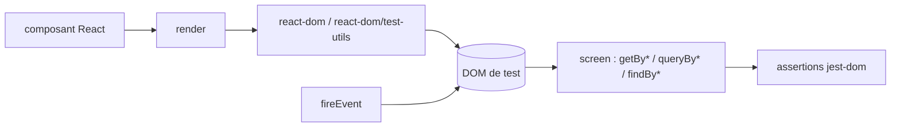

# testing-library/react-testing-library

> **Une phrase.** Utilitaires de test pour composants React qui passent par le DOM rendu plutôt que par les instances.

## Le problème

Le README le pose ainsi : on veut des tests React maintenables, qui n'incluent pas les détails
d'implémentation des composants, pour qu'un refactoring (changement d'implémentation sans
changement de fonctionnalité) ne casse pas la suite de tests et ne ralentisse pas l'équipe.

## Ce que ça fait vraiment

La bibliothèque ajoute des fonctions utilitaires au-dessus de `react-dom` et
`react-dom/test-utils`. On y trouve `render` pour monter un composant, `screen` avec ses
requêtes (`getByText`, `queryByText`, `getByLabelText`, `findByRole`…), et `fireEvent` pour
déclencher des interactions. Les requêtes `query*` renvoient l'élément ou `null`, les `get*`
renvoient l'élément ou lèvent une erreur ; les sélecteurs acceptent une expression régulière.
Le principe directeur affiché : « plus vos tests ressemblent à la façon dont votre logiciel est
utilisé, plus ils vous donnent de confiance ». Les règles d'inclusion d'un utilitaire sont
écrites dans « Guiding Principles » : travailler sur des nœuds DOM et pas sur des instances de
composants, rester utile aussi bien pour un composant isolé que pour une application complète.
Les assertions ne viennent pas d'ici : `toBeInTheDocument()` et `toHaveTextContent()` sont
fournies par le paquet séparé `@testing-library/jest-dom`.

## Comment c'est branché



Aucun diagramme tiré du code n'existe pour ce dépôt ; ce schéma est reconstruit depuis le
README. `@testing-library/dom` est une dépendance à installer à part depuis la version 16, et
`react`, `react-dom` et `@testing-library/dom` sont déclarés en `peerDependencies`.

## Essayer

```
npm install --save-dev @testing-library/react @testing-library/dom
```

```
yarn add --dev @testing-library/react @testing-library/dom
```

Pour un projet sur une version de React antérieure à 18 :

```
npm install --save-dev @testing-library/react@12


yarn add --dev @testing-library/react@12
```

## Coût et pièges

Gratuit, licence MIT, distribué via npm, à mettre en `devDependencies`. Pas de clé d'API,
pas de service tiers. Les pièges sont des pièges de version : à partir de RTL 16 il faut
installer aussi `@testing-library/dom` ; les versions 13 et suivantes exigent React 18, sinon
il faut rester en version 12. Sur React DOM 16.8, le README signale un avertissement connu
« An update to ComponentName inside a test was not wrapped in act(...) » et propose, à défaut
de pouvoir passer en 16.9, un bout de configuration qui filtre ce message dans `console.error`.

## Ce que ce n'est pas

Ce n'est pas un lanceur de tests : Jest (ou un autre runner) reste à configurer à côté, et le
README précise que les imports d'amorçage se règlent normalement dans la configuration du
framework de test. Ce n'est pas une bibliothèque d'assertions non plus : `jest-dom` est un
paquet distinct, recommandé mais pas requis. Ce n'est pas un outil de test de bout en bout :
tout se joue dans un DOM de test, pas dans un vrai navigateur ni sur un vrai appareil. Et ce
n'est pas fait pour tester un hook isolé : le README déconseille explicitement de tester en
isolation un hook personnalisé à usage unique, plutôt que le composant qui s'en sert.

## Alternatives

- `@testing-library/jest-dom` — complément et non concurrent : les matchers d'assertion qui
  manquent ici.
- React Hooks Testing Library — cité par le README pour les hooks réutilisables destinés à être
  publiés en bibliothèque, quand tester le composant appelant n'a pas de sens.
- wix/Detox — voisin de catalogue, mais sur un autre terrain : tests de bout en bout sur
  application mobile, pas de rendu DOM unitaire.

## Pour toi

Peu de recouvrement direct avec un quotidien data / MLOps, sauf si tu maintiens une interface
React au-dessus de tes modèles (tableau de bord, outil d'annotation). Dans ce cas c'est la voie
par défaut de l'écosystème React, sans coût ni dépendance externe ; sinon, passe ton chemin.
