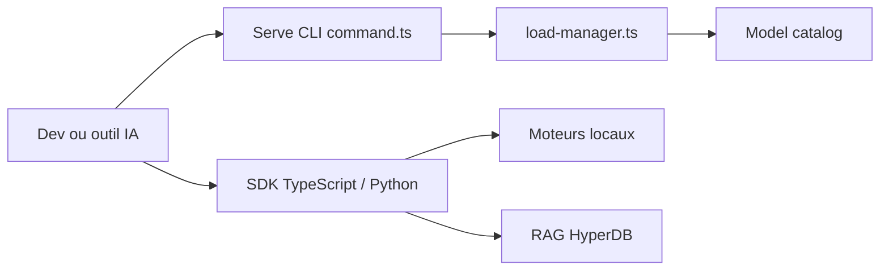

# tetherto/qvac

> SDK JS/TS et Python pour exécuter localement LLM, voix, vision et génération, avec serveur compatible OpenAI.

## Le problème
Faire tourner des modèles variés sur toutes les plateformes exige d'assembler de nombreux moteurs et d'être dépendant du cloud.

## Ce que ça fait vraiment
Un SDK unique (`@qvac/sdk`, `tetherto-qvac-sdk`) charge un modèle et lance inférence, embeddings, RAG, fine-tuning LoRA, OCR, transcription, TTS, traduction, images, vidéo, musique. Un CLI `qvac serve openai` expose une API OpenAI-compatible sur 127.0.0.1:11434. Les modèles se récupèrent en pair-à-pair via un registre distribué.

## Comment c'est branché


## Essayer
```bash
npm i @qvac/sdk
npm install -g @qvac/cli
qvac serve openai
curl http://localhost:11434/v1/chat/completions -H 'Content-Type: application/json' -d '{"model":"my-llm","messages":[{"role":"user","content":"Hello"}]}'
```

## Coût et pièges
Gratuit, mais les modèles se téléchargent au premier lancement et demandent RAM/GPU selon la charge. 124 issues ouvertes ; périmètre très large.

## Ce que ce n'est pas
Pas un seul moteur : un monorepo de nombreux backends, dont la maturité varie selon la tâche.

## Alternatives
Aucune alternative citée dans le README (compatible avec OpenCode, OpenClaw).

## Pour toi
À surveiller : intéressant pour une stack IA locale multi-tâches avec API OpenAI, mais teste d'abord les tâches qui te concernent.

