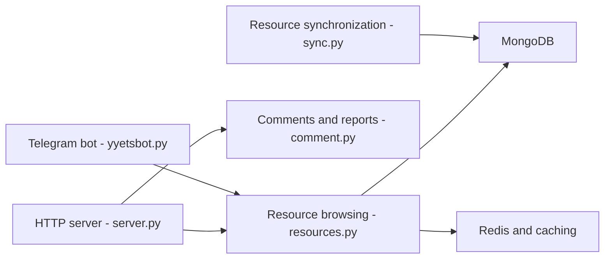

# tgbot-collection/YYeTsBot

> Site et bot Telegram d'indexation de liens de films et séries sous-titrés, en chinois.

## Le problème
Retrouver et partager des liens de ressources vidéo, avec favoris et commentaires.

## Ce que ça fait vraiment
Un serveur web Python (handlers pour ressources, commentaires, comptes, connexion sociale, métriques Grafana) adossé à MongoDB et Redis, avec indexation de recherche, plus un bot Telegram. Des outils synchronisent le catalogue, vérifient les commentaires, exportent la base et collectent des liens de partage. Auto-hébergement Docker annoncé.

## Comment c'est branché

## Essayer
Aucune commande documentée dans le README.

## Coût et pièges
Gratuit pour l'utilisateur ; le site se finance par la publicité et l'affiliation. Les liens sont déposés par des internautes ; le README décline toute responsabilité.

## Ce que ce n'est pas
Pas un outil technique réutilisable. Le projet indexe des liens vers des contenus protégés : risque de droit d'auteur, et README en chinois sans guide de déploiement.

## Alternatives
Aucune alternative nommée dans le README.

## Pour toi
À ignorer : application grand public d'indexation de liens, avec un enjeu de droits d'auteur et sans valeur pour un profil data/IA/MLOps.

