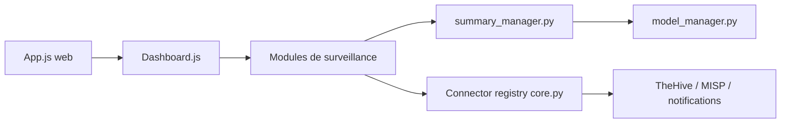

# thalesgroup-cert/Watcher

> Plateforme Django/React de veille sur les menaces cyber : domaines suspects, fuites de données, CVE, résumés par IA.

## Le problème
Une équipe sécurité doit suivre à la main flux CERT, CVE, domaines imitant sa marque et fuites de secrets sur plusieurs plateformes.

## Ce que ça fait vraiment
- Collecte CVE, victimes de ransomware et flux RSS de CERT, avec règles par mots-clés déclenchant des alertes.
- Surveille les domaines malveillants (IP, MX, contenu via hachage flou TLSH) et détecte des domaines suspects (dnstwist, certstream).
- Cherche des fuites (identifiants, clés d'API) sur des plateformes publiques de code et de partage de texte.
- Résume avec des modèles Hugging Face (flan-t5-base, bert-base-NER pour l'extraction d'IOC) ; s'intègre à TheHive, MISP, SSO/OIDC, Slack, e-mail.

## Comment c'est branché


## Essayer
```bash
git clone https://github.com/thalesgroup-cert/watcher.git
cd watcher/deployment
make init
make up
make migrate
make superuser
make populate-db
# interface : http://localhost:9002
```

## Coût et pièges
Stack Docker complète avec modèles d'IA locaux (RAM et disque). La fonction Pastebin exige un compte pro et l'IP publique autorisée. Licence AGPL-3.0 : obligations en cas de service réseau modifié.

## Ce que ce n'est pas
Ce n'est pas un outil offensif : il surveille des menaces visant ton organisation. Ce n'est pas non plus un SIEM : il alimente tes outils (TheHive, MISP) plutôt que de les remplacer.

## Alternatives
TheHive et MISP, cités comme intégrations : plateformes de gestion d'incidents et de partage d'IOC, que Watcher complète.

## Pour toi
Surveiller : pertinent si tu outilles une veille sécurité avec du NLP local, mais hors cœur data/MLOps et lourd à déployer.

