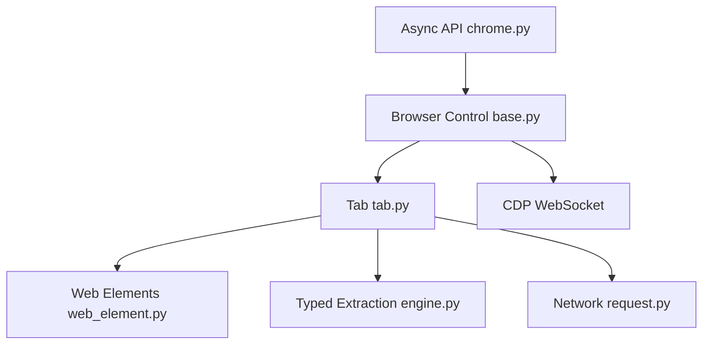

# thalissonvs/pydoll

> Bibliothèque Python asynchrone pilotant Chrome via DevTools, sans WebDriver, pour automatisation et extraction de données.

## Le problème
Les scrapers classiques via WebDriver sont repérés (drapeau `navigator.webdriver`) et se heurtent aux défis anti-bots ; il faut aussi un binaire de pilote à maintenir.

## Ce que ça fait vraiment
Elle contrôle Chrome ou Edge directement par le protocole CDP (WebSocket), en API asynchrone, synchrone ou compatible Playwright. Fonctions : mouvements de souris et frappe imitant un humain, injection d'empreinte de navigateur (à fournir soi-même), interception et enregistrement HAR du réseau, Shadow DOM et iframes, extraction typée via modèles Pydantic, proxys, multi-onglets. Le README précise que le passage des défis (Turnstile) n'est pas garanti et dépend de l'IP et du navigateur.

## Comment c'est branché


## Essayer
```bash
pip install pydoll-python
```

## Coût et pièges
Gratuit (MIT), sans binaire externe, mais Chrome ou Edge doit être installé. Le mainteneur est seul et annonce des réponses plus lentes. Contourner des protections anti-bots peut enfreindre les conditions d'un site ou la loi : à réserver à des cibles autorisées.

## Ce que ce n'est pas
Pas un contournement garanti ni un générateur d'empreintes : le README dit qu'il n'en fournit pas. Outil à double usage (tests, collecte légitime, mais aussi évitement de détection) ; Firefox n'est pas pris en charge.

## Alternatives
Le README mentionne une couche compatible Playwright, mais ne nomme pas d'autre dépôt ; non documenté.

## Pour toi
À surveiller : l'extraction typée Pydantic et l'API asynchrone sont utiles pour alimenter des jeux de données, tant que la collecte reste conforme aux conditions des sites visés et que le mainteneur unique tient le rythme.

