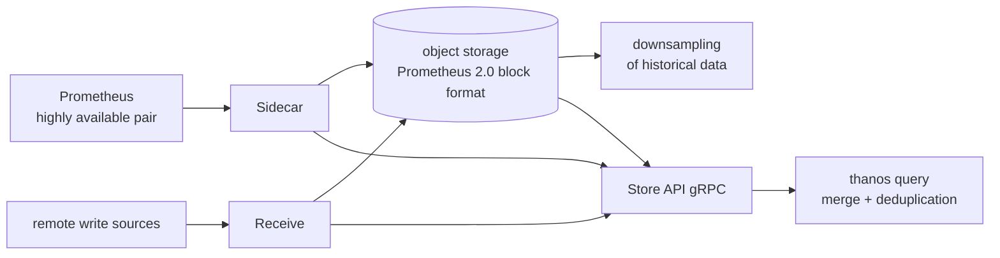

# thanos-io/thanos

> **A set of Go components giving several Prometheus servers one query view and long retention.**

## The problem

A Prometheus server is an island: it stores locally, its retention is bounded by the machine's
disk, and a query only sees the series it scraped itself. As soon as you run several clusters,
or a highly available pair of Prometheus servers, you end up opening several interfaces,
reconciling duplicated series by hand, and dropping history after a few weeks for lack of space.

## What it actually does

Thanos does not replace Prometheus: it sits on top of an existing deployment. The README states
three aims — a global query view, unlimited retention, and high availability of the components,
Prometheus included.

The core mechanism is reuse of the Prometheus 2.0 storage format: blocks are kept in their
native form and shipped to object storage, described as the project's *only* dependency, and
even that one optional. Historical data is downsampled there, which the README ties explicitly
to query speed over long ranges.

On the read path, a single gRPC "Store API" acts as the common access point for all metric
data; `thanos query` proxies incoming calls to the Store API endpoints it knows about and merges
the results. Deduplication of series collected by a highly available Prometheus pair happens on
the fly, at query time. The README also lists cross-cluster federation, fault-tolerant query
routing, and integration points for plugging in custom metric providers.

Two topologies are documented: the Sidecar deployment (for Kubernetes) and the Receive
deployment, meant for scaling out or for taking in other remote-write-compatible sources.

## How it is wired



No code-derived diagram exists for this repository: the graph above is reconstructed from the
README alone, which itself points to two images hosted outside the repository (Sidecar topology,
Receive topology). It therefore names no source files, only subcommands of the binary — the
granularity the README reasons at, each subcommand being expected to do one thing and do it well.

## Trying it

```bash
# The README gives no installation or run command.
# It points to an external page: https://thanos.io/tip/thanos/getting-started.md/
```

The only runnable element cited is where the images live: every commit to `main` builds an image
named `main-<date>-<sha>` on `quay.io/thanos/thanos`, mirrored on Docker Hub as `thanosio/thanos`.
Tarballs for major platforms are published with each minor release, every six weeks. Nothing
further is documented here: anything else would have to be reconstructed, so it is not written.

## Cost and pitfalls

- **Object storage is the real cost centre.** The README presents it as the single, optional
  dependency, yet it is what carries the unlimited-retention claim: without it, only the global
  view remains. Billed by stored volume and requests, at a third-party provider, on your budget.
- **The software is free, running it is not**: several components to deploy, monitor and upgrade,
  on top of the existing Prometheus servers.
- **No guide inside the repository**: getting started, design and the release process live on an
  external site and under `docs/`. The README alone is not enough to start.
- **Release cadence**: `main` is declared stable and usable, with minor releases every six weeks
  — following a `main-<date>-<sha>` image means following the commit stream.
- **CNCF Incubating project**, not graduated: a declared maturity stage, to be read as such.

## What it is not

- **It is not a Prometheus replacement.** Thanos adds to existing deployments: you must already
  be collecting metrics for the question to arise.
- **It is not a standalone time-series database**: the block format is Prometheus 2.0's, and
  storage is delegated to an object service.
- **It is not a single-piece product you install**: it is a set of subcommands to compose, with a
  topology to choose (Sidecar or Receive) and to operate.
- **It is not a logging, tracing or alerting solution**: nothing in the README steps outside the
  metrics perimeter.

## Alternatives

| | When to pick it instead |
|---|---|
| **VictoriaMetrics/VictoriaMetrics** | The one genuinely comparable catalogue neighbour: same ground of large-scale metrics and long retention, but as a database in its own right rather than a layer over existing Prometheus servers. Pick it if you would rather swap the storage engine than add a layer to it. |
| **netdata/netdata** | Catalogue neighbour, better suited to real-time monitoring of a fleet with collection and UI bundled — a different problem from long retention and a multi-cluster global view. |
| **kubernetes/kube-state-metrics** | Catalogue neighbour, not comparable: it *produces* metrics about Kubernetes objects, it neither aggregates nor retains them. It sits upstream of a Prometheus, hence upstream of Thanos. |

The fourth suggested neighbour, `DataDog/datadog-agent`, belongs to a commercial hosted offering:
comparable on use, not on the nature of the project.

## For you

Worth watching rather than adopting by default: Thanos only becomes relevant once you run several
Prometheus servers, or want to keep metrics beyond a few weeks — typically to correlate model
drift with infrastructure over months. In that case it is a mature piece, under CNCF governance,
with a steady release cadence. With a single Prometheus and three weeks of retention that suffice,
adding it only adds components to operate.
