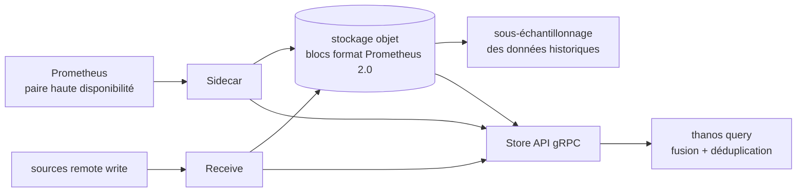

# thanos-io/thanos

> **Un jeu de composants Go qui donnent à plusieurs Prometheus une vue unique et une rétention longue.**

## Le problème

Un Prometheus est une île : il stocke localement, sa rétention est bornée par le disque de la
machine, et une requête ne voit que les séries qu'il a lui-même collectées. Dès qu'on exploite
plusieurs clusters, ou une paire de Prometheus en haute disponibilité, on se retrouve à ouvrir
plusieurs interfaces, à comparer des séries dupliquées à la main, et à jeter l'historique au
bout de quelques semaines faute de place.

## Ce que ça fait vraiment

Thanos ne remplace pas Prometheus : il se pose au-dessus d'un déploiement existant. Le README
énonce trois objectifs — vue de requête globale, rétention non bornée, haute disponibilité des
composants, Prometheus compris.

Le mécanisme central est la réutilisation du format de stockage de Prometheus 2.0 : les blocs
sont conservés dans leur format natif et versés dans un stockage objet, présenté comme la
*seule* dépendance du projet, et encore facultative. Les données historiques y sont
sous-échantillonnées, ce que le README relie explicitement à la vitesse des requêtes longues.

Côté lecture, une API gRPC unique, la « Store API », sert de point d'accès commun à toutes les
sources de métriques ; `thanos query` relaie les appels entrants vers les points d'accès Store
API qu'il connaît et fusionne les résultats. La déduplication des séries collectées par une
paire de Prometheus en haute disponibilité se fait à la volée, au moment de la requête. Le
README annonce aussi une fédération inter-clusters, un routage de requêtes tolérant aux pannes,
et des points d'intégration pour brancher ses propres fournisseurs de métriques.

Deux topologies sont documentées : le déploiement avec *Sidecar* (pour Kubernetes) et le
déploiement avec *Receive*, destiné à passer à l'échelle ou à accueillir des sources compatibles
remote write.

## Comment c'est branché



Aucun diagramme tiré du code n'existe pour ce dépôt : ce schéma est reconstruit depuis le seul
README, qui renvoie pour sa part à deux images hébergées hors du dépôt (topologie Sidecar,
topologie Receive). Il ne nomme donc pas de fichiers du code, seulement des sous-commandes du
binaire — c'est la granularité à laquelle le README raisonne, chaque sous-commande devant
« faire une chose et la faire bien ».

## Essayer

```bash
# Aucune commande d'installation ni d'exécution n'est donnée dans le README.
# Il renvoie vers une page externe : https://thanos.io/tip/thanos/getting-started.md/
```

Le seul élément exécutable cité est l'emplacement des images : chaque commit sur `main` produit
une image nommée `main-<date>-<sha>` sur `quay.io/thanos/thanos`, avec un miroir Docker Hub
`thanosio/thanos`. Des archives pour les principales plateformes sont publiées à chaque version
mineure, toutes les six semaines. Rien de plus n'est documenté ici : tout le reste se reconstruirait,
donc n'est pas écrit.

## Coût et pièges

- **Le stockage objet est le vrai poste de coût.** Le README le présente comme unique dépendance
  et comme facultatif, mais c'est lui qui porte la promesse de rétention non bornée : sans lui,
  il ne reste que la vue globale. Facturation au volume stocké et aux requêtes, chez un
  fournisseur tiers, à ta charge.
- **Le logiciel est gratuit, l'exploitation ne l'est pas** : plusieurs composants à déployer,
  superviser et mettre à jour, en plus des Prometheus existants.
- **Pas de guide dans le dépôt** : la prise en main, la conception et le processus de version
  vivent sur un site externe et dans `docs/`. Le README seul ne suffit pas à démarrer.
- **Rythme de version** : `main` est annoncée stable et utilisable, avec des versions mineures
  toutes les six semaines — suivre une image `main-<date>-<sha>` revient à suivre le rythme des
  commits.
- **Projet en incubation CNCF**, pas en phase diplômée : un état d'avancement déclaré, à prendre
  comme tel.

## Ce que ce n'est pas

- **Ce n'est pas un remplaçant de Prometheus.** Thanos s'ajoute à des déploiements existants :
  il faut déjà collecter des métriques pour que la question se pose.
- **Ce n'est pas une base de données de séries temporelles autonome** : le format des blocs est
  celui de Prometheus 2.0, et le stockage est délégué à un service objet.
- **Ce n'est pas un produit d'un seul tenant qu'on installe** : c'est un jeu de sous-commandes à
  composer, avec une topologie à choisir (Sidecar ou Receive) et à opérer.
- **Ce n'est pas une solution de journaux, de traces ou d'alerte** : rien dans le README ne sort
  du périmètre des métriques.

## Alternatives

| | Quand le préférer |
|---|---|
| **VictoriaMetrics/VictoriaMetrics** | Voisin du catalogue, le seul réellement comparable : même terrain des métriques à grande échelle et longue rétention, mais en base de données à part entière plutôt qu'en couche posée sur des Prometheus existants. À préférer si l'on accepte de changer de moteur de stockage plutôt que d'en ajouter une couche. |
| **netdata/netdata** | Voisin du catalogue, à préférer pour la supervision temps réel d'un parc de machines avec collecte et interface intégrées — problème différent de la rétention longue et de la vue globale multi-clusters. |
| **kubernetes/kube-state-metrics** | Voisin du catalogue, non comparable : il *produit* des métriques sur les objets Kubernetes, il ne les agrège ni ne les conserve. Il se place en amont d'un Prometheus, donc en amont de Thanos. |

Le quatrième voisin proposé, `DataDog/datadog-agent`, relève d'une offre commerciale hébergée :
comparaison possible sur l'usage, pas sur la nature du projet.

## Pour toi

À surveiller plutôt qu'à adopter par défaut : Thanos ne devient pertinent que si l'on exploite
déjà plusieurs Prometheus, ou si l'on veut garder des métriques au-delà de quelques semaines —
typiquement pour corréler une dérive de modèle avec l'infrastructure sur plusieurs mois. Dans ce
cas, c'est une pièce mûre, sous gouvernance CNCF, avec un rythme de version régulier. Si l'on a
un seul Prometheus et trois semaines de rétention suffisantes, l'ajouter ne fait qu'ajouter des
composants à exploiter.
