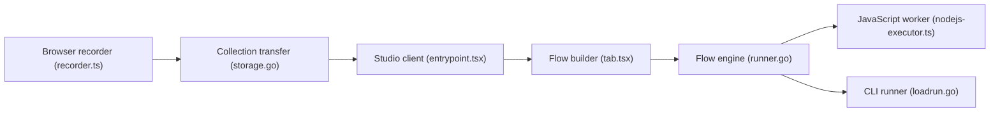

# the-dev-tools/dev-tools

> Testeur d'API local de type Postman, avec enregistrement navigateur et flux visuels exécutables en CI.

## Le problème
Les testeurs d'API courants imposent compte et cloud, et leurs tests s'intègrent mal à la CI.

## Ce que ça fait vraiment
Application de bureau et CLI : requêtes HTTP, GraphQL et WebSocket, collections, constructeur de flux (nœuds requête, condition, boucle, données Excel) avec chaînage de variables. Une extension Chrome enregistre les requêtes. Import/export au format compatible Postman. Exécution locale.

## Comment c'est branché


## Essayer
```bash
curl -fsSL https://sh.dev.tools/install.sh | bash
wget -qO- https://sh.dev.tools/install.sh | bash
```

## Coût et pièges
Gratuit, sans compte. L'installateur est exécuté via `curl | bash` et écrit dans `/usr/local/bin`.

## Ce que ce n'est pas
Pas un outil de test de charge ni de modèles ; les commandes CLI de lancement des flux ne sont pas détaillées dans le README.

## Alternatives
Postman, cité dans le README pour la comparaison.

## Pour toi
À surveiller : utile pour tester des API de modèles servis, mais README court sur l'usage CLI en CI.

