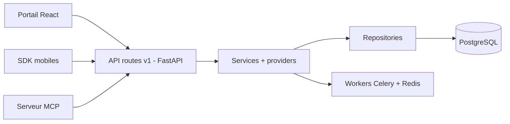

# the-momentum/open-wearables

> Plateforme auto-hébergée qui unifie les données de montres connectées derrière une API et un serveur MCP.

## Le problème
Chaque fournisseur (Garmin, Whoop, Oura, Apple Health) a sa propre API, ses flux OAuth et ses formats.

## Ce que ça fait vraiment
Un backend FastAPI normalise les données (résumés quotidiens, séries temporelles, sommeil, séances) dans PostgreSQL. Celery et Redis exécutent la synchronisation et les reprises d'historique. Il apporte webhooks, priorités de sources, un portail développeur React et des SDK mobiles (iOS, Android, Flutter, React Native). Un serveur MCP et un SDK Python permettent d'interroger les données depuis un LLM. Instance mono-organisation.

## Comment c'est branché


## Essayer
```bash
git clone https://github.com/the-momentum/open-wearables.git
cd open-wearables
cp ./backend/config/.env.example ./backend/config/.env
cp ./frontend/.env.example ./frontend/.env
docker compose up -d
make seed
```

## Coût et pièges
Gratuit en auto-hébergement, mais les identifiants OAuth de chaque fournisseur sont à créer. Le compte admin par défaut est créé au démarrage : changer le mot de passe tout de suite. Le `docker compose` est prévu pour le développement ; en production, utiliser les images officielles avec un tag stable.

## Ce que ce n'est pas
Ce n'est pas un service médical ni un produit clé en main : les données de santé restent sous ta responsabilité (hébergement, conformité). Toutes les limites des fournisseurs (historique) s'appliquent.

## Alternatives
Aucune alternative nommée dans le README.

## Pour toi
À surveiller : bonne base pour alimenter un agent IA avec des données de santé auto-hébergées, si tu maîtrises la conformité de ces données sensibles.

