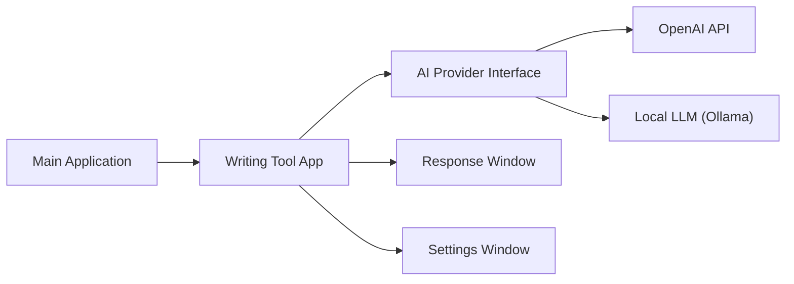

# theJayTea/WritingTools

> Assistant de correction et de réécriture système par raccourci clavier, avec LLM cloud ou local.

## Le problème
Corriger, reformuler ou résumer du texte dans n'importe quelle application oblige à copier vers un chatbot.

## Ce que ça fait vraiment
Sélectionner du texte, `ctrl+espace`, choisir corriger, reformuler, ton, résumé, points clés, tableau ou instruction libre ; le texte est remplacé. Fournisseurs : Gemini, API compatible OpenAI, Ollama, llama.cpp, Mistral. Windows et Linux en Python, macOS en port natif Swift (MLX local possible). Chat sans sélection, boutons personnalisés.

## Comment c'est branché


## Essayer
```bash
ollama pull llama3.1:8b
```
Puis régler le fournisseur « OpenAI-Compatible » avec la clé `ollama`, l'URL `http://localhost:11434/v1` et le modèle `llama3.1:8b`. Le binaire Windows se télécharge dans les releases.

## Coût et pièges
Gratuit avec Gemini (clé) ou local (environ 8 Go de RAM/VRAM pour Llama 3.1 8B). Support Wayland partiel. Conflits de raccourci signalés sur la v9. Le texte part chez le fournisseur cloud choisi.

## Ce que ce n'est pas
Pas « plus intelligent que Grammarly » de façon démontrée : formule marketing du README. Le formatage riche est perdu dans Word.

## Alternatives
Aucune alternative nommée dans le README.

## Pour toi
À surveiller : utile au quotidien avec un modèle local pour garder les textes sensibles chez toi ; un seul mainteneur, adolescent selon le README.
