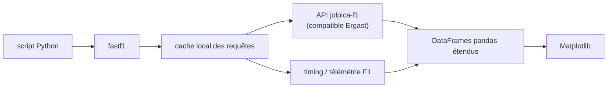

# theOehrly/Fast-F1

> Bibliothèque Python d'accès aux chronos, télémétries et résultats de Formule 1, en DataFrames.

## Le problème
Les données de timing et de télémétrie F1 sont éparpillées entre plusieurs endpoints et formats ;
les récupérer et les aligner soi-même à chaque script coûte plus de temps que l'analyse.

## Ce que ça fait vraiment
Expose sessions, résultats, calendriers, timing et télémétrie sous forme de DataFrames pandas
étendus, avec des méthodes ajoutées sur les objets pandas spécifiquement pour les données F1.
Supporte l'API `jolpica-f1`, compatible Ergast, pour l'historique et la saison en cours. Met en
cache toutes les requêtes API pour que les scripts répétés ne rappellent pas la source. Intègre
Matplotlib pour la visualisation.

## Comment c'est branché


## Essayer
```bash
pip install fastf1
# ou
conda install -c conda-forge fastf1
```

## Coût et pièges
Gratuit, aucune clé. Le coût réel est la dépendance à une API tierce (`jolpica-f1`) et au flux de
timing : si la source change ou tombe, les scripts s'arrêtent. Le cache disque grossit vite.

## Ce que ce n'est pas
Pas un produit officiel : le README précise que le projet n'est associé d'aucune façon aux sociétés
Formula 1, et que les marques appartiennent à Formula One Licensing B.V. Pas de garantie de
fonctionnement sous Pyodide / JupyterLite : compatibilité annoncée mais non testée à fond.

## Alternatives
- `jolpica-f1` directement : si on veut l'API brute sans couche pandas.
- `f1dataR` (CRAN) : enrobage R de FastF1, pour qui travaille en R.

## Pour toi
Excellent terrain d'entraînement pandas/viz avec des données réelles, propres et gratuites.
