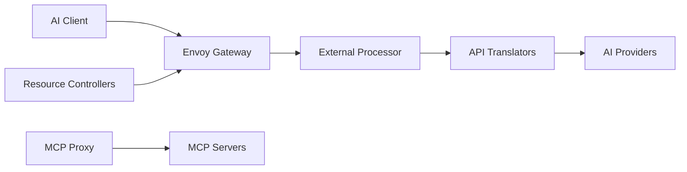

# theagentrouter/agent-router

> Plan de contrôle open source, basé sur Envoy, pour le trafic IA et agents (ex Envoy AI Gateway).

## Le problème
Les équipes applicatives multiplient clés et fournisseurs de modèles ; la plateforme veut centraliser routage, quotas, bascule et attribution des coûts.

## Ce que ça fait vraiment
Une API unique compatible OpenAI devant modèles hébergés, inférence auto-hébergée et serveurs MCP. Sur Kubernetes, des CRD (`AIGatewayRoute`, `AIServiceBackend`, `BackendSecurityPolicy`) sont réconciliées en configuration Envoy Gateway. Un processeur externe authentifie, traduit les API, applique quotas et mesure l'usage ; un proxy MCP traite ce trafic. Une CLI `aigw run` le lance en autonome. Schéma à deux niveaux : passerelle d'entrée et passerelle de cluster de modèles.

## Comment c'est branché


## Essayer
```bash
OPENAI_API_KEY=sk-your-key aigw run
```
Puis pointer un client compatible OpenAI sur `http://localhost:1975/v1`.

## Coût et pièges
Le mode complet suppose Kubernetes et Envoy Gateway. Les clés des fournisseurs restent à ta charge. 299 issues ouvertes. Les noms techniques (CRD, images, module Go) n'ont pas changé malgré le renommage.

## Ce que ce n'est pas
Pas un gestionnaire d'agents ni un moteur d'inférence : il route et contrôle le trafic.

## Alternatives
- Aucune alternative nommée dans le README.

## Pour toi
Surveiller : pertinent pour une plateforme MLOps multi-modèles sur Kubernetes ; surdimensionné pour un usage individuel.
