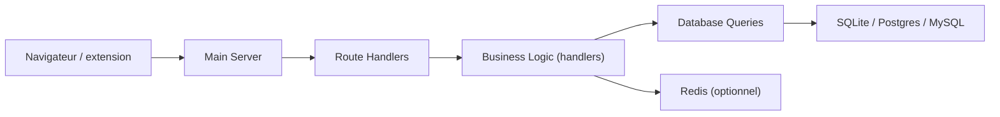

# thedevs-network/kutt

> Raccourcisseur d'URL auto-hébergeable avec domaines personnalisés, statistiques et gestion d'utilisateurs.

## Le problème
Les raccourcisseurs SaaS imposent leur domaine, leurs quotas et gardent tes statistiques de clics.

## Ce que ça fait vraiment
Serveur Node.js (Express, vues Handlebars) : création et édition de liens avec mot de passe, expiration et description, statistiques privées, page d'administration, API REST, connexion OIDC. SQLite par défaut, Postgres ou MySQL en option, Redis pour le cache. Des files et des tâches cron tournent en arrière-plan.

## Comment c'est branché


## Essayer
```bash
npm install
npm run migrate
npm start
docker compose up
```

## Coût et pièges
`JWT_SECRET` est obligatoire en production. L'inscription est désactivée par défaut et dépend du courriel (`MAIL_ENABLED`). Les certificats des domaines personnalisés sont à générer soi-même. Le domaine `kutt.it` n'appartient plus au projet (alerte phishing du README).

## Ce que ce n'est pas
Pas un outil de web-analytics complet : uniquement des statistiques de clics. Les vues personnalisées peuvent casser à chaque mise à jour.

## Alternatives
Aucune alternative nommée dans le README.

## Pour toi
À ignorer pour un profil data/IA : c'est une application web générique, utile seulement si tu veux héberger toi-même des liens courts.

