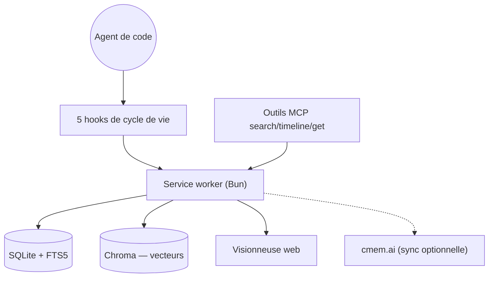

# thedotmack/claude-mem

> Mémoire persistante entre sessions pour un agent de code, avec recherche hybride locale.

## Le problème
Chaque session repart de zéro : l'agent réapprend le projet, les décisions passées et les pièges connus.
Recopier un résumé à la main à chaque reprise ne passe pas à l'échelle.

## Ce que ça fait vraiment
Cinq hooks de cycle de vie capturent les observations d'usage d'outils et génèrent des résumés sémantiques.
Un service worker local (Bun) expose une API HTTP, une interface web de flux mémoire et des endpoints de recherche.
Stockage SQLite avec recherche plein texte FTS5, plus Chroma pour la recherche vectorielle hybride.
Quatre outils MCP en trois couches — `search` (index), `timeline` (contexte), `get_observations` (détail) — pour limiter les tokens.

## Comment c'est branché


## Essayer
```bash
npx claude-mem install
npx claude-mem install --ide opencode
ls ~/.claude/plugins/marketplaces/thedotmack/plugin/modes/
```

## Coût et pièges
Le fournisseur de mémoire par défaut est hébergé (CMEM Pro), gratuit 30 jours puis payant ; `--provider host` reste local.
L'installateur demande une connexion par lien magique ; `CLAUDE_MEM_ONLINE_OPTIN=false` la contourne.

## Ce que ce n'est pas
Pas purement local par défaut — les observations partent vers un service tiers sauf configuration explicite.
`npm install -g claude-mem` n'installe que la bibliothèque, pas les hooks ni le worker.
Le README associe le projet à un jeton crypto « CMEM » ; aucune licence n'y est déclarée.

## Alternatives
- `NousResearch/hermes-agent` : mémoire et rappel intégrés à l'agent plutôt qu'ajoutés par-dessus.
- `Graphify-Labs/graphify` : cartographie du dépôt plutôt que mémoire de session.

## Pour toi
L'idée est bonne, l'empaquetage inquiète (SaaS par défaut, jeton, licence absente). À surveiller de loin.
