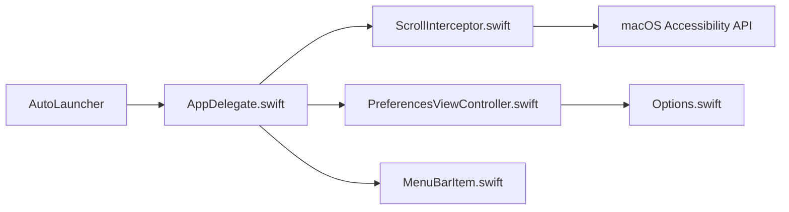

# ther0n/UnnaturalScrollWheels

> Utilitaire macOS qui inverse le défilement de la molette de souris sans toucher au pavé tactile.

## Le problème
Sous macOS, l'option « défilement naturel » est partagée entre souris et trackpad : inverser l'un inverse l'autre.

## Ce que ça fait vraiment
Une application de barre de menus qui intercepte les événements de défilement via l'API d'accessibilité macOS, inverse ceux de la molette et peut désactiver l'accélération de la souris. Un exécutable `AutoLauncher` lance l'application au démarrage. Les préférences se rouvrent en relançant l'app si l'icône est masquée.

## Comment c'est branché


## Essayer
```bash
brew install --cask unnaturalscrollwheels
```

## Coût et pièges
Gratuit. Demande la permission d'accessibilité « Contrôler l'ordinateur », nécessaire pour intercepter et modifier les événements. Licence GPL-3.0.

## Ce que ce n'est pas
Pas un outil de développement ni de productivité data : un correctif de confort pour macOS uniquement.

## Alternatives
Aucune alternative nommée dans le README (une discussion Apple StackExchange décrit le problème).

## Pour toi
À ignorer : utilitaire de confort macOS sans lien avec la data ou l'IA, utile seulement si tu utilises une souris à molette sur Mac.

