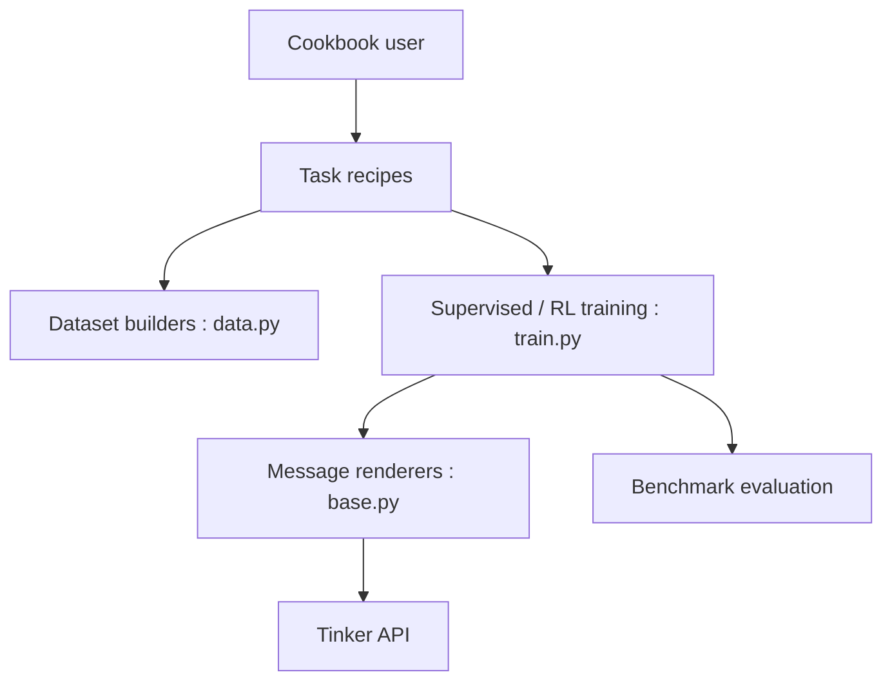

# thinking-machines-lab/tinker-cookbook

> Recettes et abstractions pour affiner des modèles de langage via l'API de formation Tinker, pour chercheurs et ingénieurs.

## Le problème
Mettre en place SFT, RL ou DPO distribués demande beaucoup d'infrastructure.

## Ce que ça fait vraiment
Le SDK `tinker` envoie des requêtes à un service qui gère l'entraînement distribué (LoRA). Ce dépôt apporte des recettes : SFT de chat, RL pour les maths et le code, préférences (DPO, RLHF), distillation, outils, multi-agents, audio, VLM. Il contient aussi des renderers, des utilitaires d'hyperparamètres et un cadre d'évaluation expérimental (12 benchmarks). Des skills Claude Code sont fournis.

## Comment c'est branché


## Essayer
```bash
export TINKER_API_KEY=...
uv pip install tinker-cookbook
marimo edit tutorials/101_hello_tinker.py
```

## Coût et pièges
Inscription et clé d'API sur Tinker requises ; l'entraînement s'exécute chez eux et se paie (voir « Models & Pricing » cité). Torch 2.10 ou plus.

## Ce que ce n'est pas
Pas un entraînement local : sans accès au service, les recettes ne tournent pas. Les scores de benchmarks dépendent beaucoup de la configuration, avertit le README.

## Alternatives
Aucune alternative nommée dans le README.

## Pour toi
À surveiller : des recettes de post-entraînement très instructives à lire, mais l'exécution dépend d'un service payant tiers.

