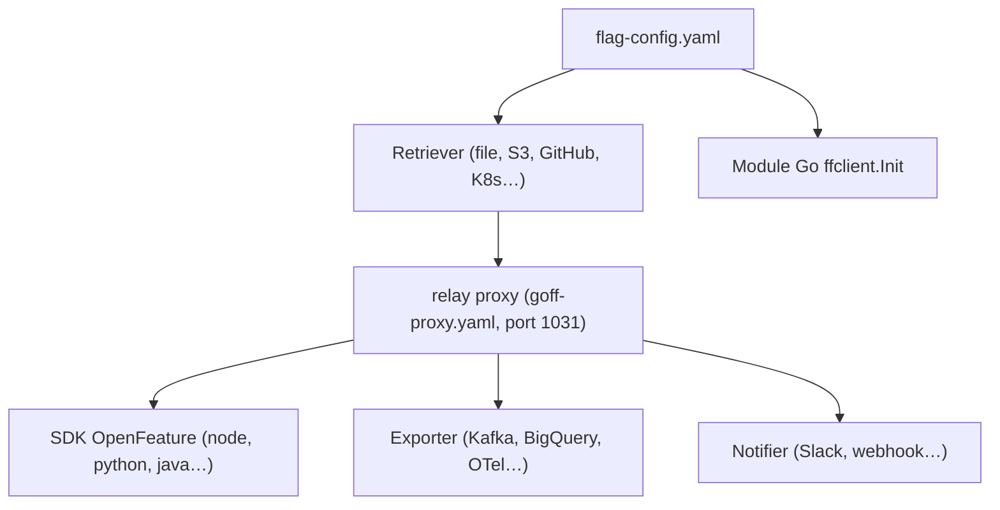

# thomaspoignant/go-feature-flag

> Feature flags complets pilotés par un simple fichier de configuration, sans backend à maintenir.

## Le problème
Les solutions de feature flags imposent un service tiers et une facture, alors que le besoin
tient souvent dans un fichier YAML versionné.

## Ce que ça fait vraiment
Centralise tous les flags dans un fichier YAML, JSON ou TOML, récupéré depuis une quinzaine
de sources (GitHub, GitLab, HTTP, S3, fichier local, Google Cloud Storage, ConfigMaps
Kubernetes, MongoDB, Redis, BitBucket, Azure Blob, PostgreSQL). Deux modes d'usage : module Go
qui évalue directement dans le code, ou **relay proxy** hébergé qui expose une API et rend la
solution multi-langage via les SDK OpenFeature (Go, Java/Kotlin, JS/TS serveur et client,
Python, .NET, Ruby, Swift, PHP, Rust via OFREP). Règles de ciblage en langage d'expression
simple (`eq`, `co`, `sw`, `in`, `pr`…) ou en JSONLogic, format autodétecté. Rollouts par
pourcentage, progressifs, planifiés, ou expérimentation bornée dans le temps. Export des
évaluations vers S3, Kinesis, SQS, GCS, PubSub, Kafka, BigQuery, Azure Blob, webhook,
OpenTelemetry. Notifications Slack, Discord, Teams, webhook, log.

## Comment c'est branché


## Essayer
```bash
docker run \
  -p 1031:1031 \
  -v $(pwd)/flag-config.yaml:/goff/flag-config.yaml \
  -v $(pwd)/goff-proxy.yaml:/goff/goff-proxy.yaml \
  gofeatureflag/go-feature-flag:latest
go get github.com/thomaspoignant/go-feature-flag
npm i @openfeature/server-sdk @openfeature/go-feature-flag-provider
```

## Coût et pièges
Gratuit, pas de service tiers obligatoire. Le README recommande le relay proxy plutôt que le
module Go dès qu'il y a plus d'un langage. Une clé de ciblage (`targetingKey`) unique est
obligatoire à chaque évaluation, et il est conseillé d'utiliser un hash plutôt qu'un e-mail.
En local le fichier suffit ; en production il faut un stockage distant.

## Ce que ce n'est pas
Ce n'est pas une plateforme avec interface d'administration hébergée — un éditeur web existe
(editor.gofeatureflag.org) mais la vérité reste le fichier. Ce n'est plus une bibliothèque Go
uniquement. Et l'export ne couvre pour l'instant que les « feature events ».

## Alternatives
- OpenFeature, le standard sur lequel il s'appuie : changer de fournisseur ne casse pas le code.
- `go-feature-flag-cli`, l'outil de lint de la configuration, complémentaire.

## Pour toi
Le choix sobre pour piloter des variantes de modèles ou de pipelines sans prendre un SaaS.
