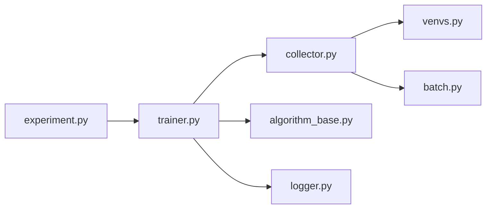

# thu-ml/tianshou

> Bibliothèque d'apprentissage par renforcement en PyTorch et Gymnasium, pour chercheurs et praticiens.

## Le problème
Les bibliothèques RL ont souvent un code complexe, une API de haut niveau peu pratique ou une vitesse limitée.

## Ce que ça fait vraiment
Propose une API de haut niveau (`ExperimentBuilder`) et une API procédurale. Implémente DQN et variantes, PPO, SAC, TD3, plus RL hors ligne (CQL, BCQ), imitation, GAIL, replay priorisé. Environnements vectorisés (EnvPool), logs TensorBoard et W&B. La version 2 sépare `Algorithm` et `Policy` et casse la compatibilité.

## Comment c'est branché


## Essayer
```bash
git clone git@github.com:thu-ml/tianshou.git
cd tianshou
poetry install
pip install tianshou
```

## Coût et pièges
Python 3.11+. Le README dit que le paquet PyPI est « far behind the master ». Migration depuis la v1 nécessaire.

## Ce que ce n'est pas
Pas un catalogue d'environnements. Le multi-agent et le model-based sont expérimentaux.

## Alternatives
- Stable-Baselines3, Ray/RLlib, SpinningUp, Dopamine, ACME, Sample Factory : comparés dans le tableau du README.

## Pour toi
À adopter pour des expériences RL reproductibles : MIT, soutenu par appliedAI, tests d'entraînement complets.

