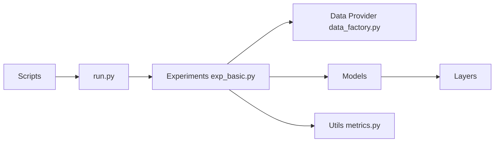

# thuml/Time-Series-Library

> Base de code PyTorch pour évaluer et développer des modèles profonds de séries temporelles.

## Le problème
Comparer honnêtement des modèles de séries temporelles exige les mêmes données, fenêtres et métriques pour tous.

## Ce que ça fait vraiment
Cinq tâches unifiées : prévision long/court terme, imputation, détection d'anomalies, classification.
40+ modèles (TimesNet, iTransformer, PatchTST, DLinear, TimeXer, Mamba…) et évaluation zero-shot de modèles fondation (Chronos, TimesFM, Moirai, Sundial…).
`run.py` choisit l'expérience selon `task_name` ; scripts bash reproduisant les configurations des papiers.
Ajouter un modèle = un fichier dans `models/` et un script.

## Comment c'est branché


## Essayer
```bash
git clone https://github.com/thuml/Time-Series-Library.git
cd Time-Series-Library
conda create -n tslib python=3.11
pip install torch==2.5.1 --index-url https://download.pytorch.org/whl/cu121
pip install -r requirements.txt
bash ./scripts/long_term_forecast/ETT_script/TimesNet_ETTh1.sh
```

## Coût et pièges
Gratuit ; PyTorch lié à ta version CUDA, Mamba Linux uniquement. Données à télécharger à part.

## Ce que ce n'est pas
Plus de nouvelles fonctionnalités actives (avril 2026) ; les benchmarks sont en partie saturés selon les auteurs.

## Alternatives
- thuml/OpenLTM : paradigme pré-entraînement/fine-tuning pour grands modèles de séries temporelles.

## Pour toi
À adopter comme banc d'essai de baselines séries temporelles : implémentations correctes et reproductibles, en gardant un œil critique sur les benchmarks.
