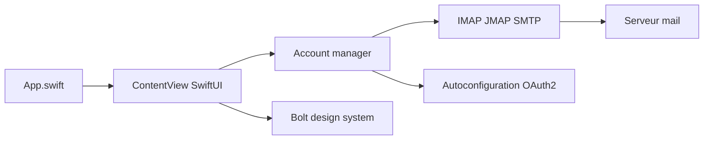

# thunderbird/thunderbird-ios

> Client mail natif iOS de Thunderbird, encore à l'état de fondations et non fonctionnel.

## Le problème
Thunderbird n'existe pas sur iOS ; le projet veut y apporter un client mail axé triage et intégration bureau.

## Ce que ça fait vraiment
Le README avoue que l'application n'est ni fonctionnelle ni prête, l'objectif immédiat étant une version TestFlight. D'après le code : app SwiftUI, paquet Swift `Core` (comptes, découverte automatique DNS/OAuth2, clients IMAP, JMAP et SMTP, parseur MIME) et paquet `Bolt` pour le design.

## Comment c'est branché

## Essayer
Aucune commande documentée dans le README.

## Coût et pièges
Xcode et Mac requis pour compiler. Pas de version installable stable annoncée ; TestFlight visé en premier, App Store plus tard.

## Ce que ce n'est pas
Pas un client utilisable aujourd'hui : lire et écrire des mails viendra plus tard.

## Alternatives
Aucune alternative nommée dans le README.

## Pour toi
Ignorer : client mail iOS non fonctionnel, sans rapport avec la data ou l'IA.

