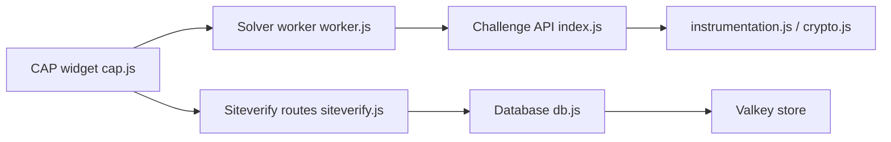

# tiagozip/cap

> Alternative open source aux CAPTCHA visuels, par preuve de travail, pour développeurs de sites web.

## Le problème
Les CAPTCHA visuels gênent les visiteurs, pèsent lourd et passent par des services tiers qui posent des questions de vie privée.

## Ce que ça fait vraiment
Un widget navigateur (~20 ko selon le README) demande un défi, le résout dans un worker (avec un solveur WASM) puis renvoie le résultat. Le serveur valide via une route `siteverify`. Un mode « standalone » en conteneur Docker ajoute tableau de bord d'administration et API de configuration. Des contrôles d'« instrumentation » complètent la preuve de travail.

## Comment c'est branché

## Essayer
Le README ne donne pas de commande : il indique que la voie par défaut est le conteneur Docker « Standalone » et renvoie à la documentation en ligne et à une démo (déploiement Railway).

## Coût et pièges
Gratuit, sans télémétrie annoncée. Il faut héberger le conteneur standalone (et un Valkey d'après l'architecture). Le README annonce Apache 2.0, mais GitHub n'identifie pas la licence : à vérifier avant usage.

## Ce que ce n'est pas
Pas une protection anti-bot absolue : une preuve de travail renchérit l'attaque sans la rendre impossible. Le « 250x plus léger que hCaptcha » est une affirmation du README, non mesurée ici.

## Alternatives
- reCAPTCHA : service Google très répandu.
- hCaptcha : service tiers commercial, déjà largement intégré.
- Cloudflare Turnstile : gratuit et sans hébergement à ta charge.

## Pour toi
À surveiller : utile si tu exposes un formulaire ou une API publique, mais le projet est jeune, tenu par une personne et sa licence n'est pas confirmée.
