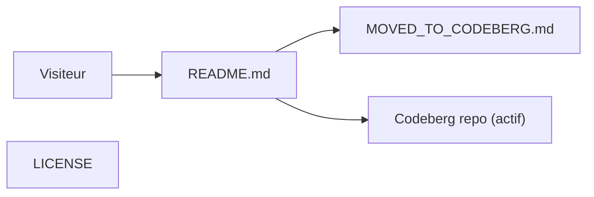

# tidalcycles/strudel

> Ancien dépôt de Strudel, live coding de motifs musicaux dans le navigateur, déménagé sur Codeberg.

## Le problème
Sans objet ici : le dépôt ne sert plus qu'à rediriger vers le nouveau site.

## Ce que ça fait vraiment
Le README annonce « Live coding patterns on the web » et indique que le développement est passé sur codeberg.org/uzu/strudel. D'après l'architecture, il ne reste que README, MOVED_TO_CODEBERG.md et LICENSE.

## Comment c'est branché

## Essayer
Aucune commande. Le site public cité est https://strudel.cc/ et le code actif est sur Codeberg.

## Coût et pièges
Rien à installer ici. Ne pas suivre ce dépôt : il est archivé.

## Ce que ce n'est pas
Pas le projet vivant : aucun code source n'est présent. Fiche minimale, le README faisant moins de 800 caractères.

## Alternatives
- codeberg.org/uzu/strudel : nouvelle adresse du développement.

## Pour toi
À ignorer : archivé et vide de code ; si le live coding musical t'intéresse, suis le dépôt Codeberg.

