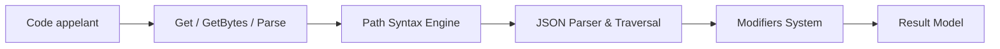

# tidwall/gjson

> Package Go pour lire rapidement des valeurs dans un document JSON avec une syntaxe de chemin simple.

## Le problème
Extraire un champ d'un JSON en Go oblige à définir des structures ou à décoder en `map`, avec beaucoup d'allocations.

## Ce que ça fait vraiment
`gjson.Get(json, "name.last")` renvoie la valeur sans tout décoder. Chemins avec points, jokers, index de tableau, requêtes `#(...)`, modificateurs (`@reverse`, `@pretty`, `@flatten`, `@dig`…) extensibles par `AddModifier`, JSON Lines avec le préfixe `..`, itération avec `ForEach`. Le README donne des benchmarks (202 ns/op, 0 allocation pour `Get`) sur un MacBook M1 Max : mesures de l'auteur.

## Comment c'est branché


## Essayer
```bash
go get -u github.com/tidwall/gjson
```
```go
value := gjson.Get(json, "name.last")
println(value.String())
```

## Coût et pièges
Gratuit. Le JSON doit être bien formé : utiliser `gjson.Valid` pour une source non fiable (un JSON invalide ne fait pas paniquer, mais donne des résultats imprévus). 100 issues ouvertes.

## Ce que ce n'est pas
Ce n'est pas un outil de modification : le README renvoie vers SJSON pour écrire et JJ pour la ligne de commande.

## Alternatives
SJSON pour modifier du JSON et JJ en ligne de commande, tous deux du même auteur ; versions Python et Rust mentionnées.

## Pour toi
À adopter si tu écris des services ou outils Go qui lisent des journaux JSON ou du JSON Lines : léger, sans dépendance, et syntaxe efficace.

