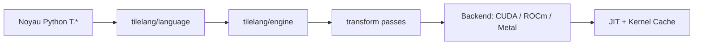

# tile-ai/tilelang

> Langage Python dédié pour écrire des noyaux GPU/CPU (GEMM, attention) au-dessus de TVM.

## Le problème
Écrire des noyaux GPU performants en CUDA à la main est lent et lié à un fabricant.

## Ce que ça fait vraiment
DSL Pythonique (`@tilelang.jit`, `T.Kernel`, `T.gemm`, `T.Pipelined`) compilé via un pipeline d'IR vers CUDA, ROCm, Metal, CPU (LLVM) et WebGPU. Comprend autotuning, cache de noyaux, exemples FlashAttention, DeepSeek MLA/V3.2/V4. Le README cite des benchmarks sur H100, A100, MI300X, RTX 4090.

## Comment c'est branché


## Essayer
```bash
pip install tilelang
python -c "import tilelang; print(tilelang.__version__)"
pip install tilelang --find-links https://tile-ai.github.io/whl/nightly
```

## Coût et pièges
Gratuit ; GPU nécessaire pour l'exécution. Les versions nightly peuvent être instables. Licence non identifiée par GitHub. 313 issues ouvertes.

## Ce que ce n'est pas
Pas une bibliothèque de modèles : c'est un compilateur de noyaux, il faut connaître le tuilage GPU.

## Alternatives
Aucune alternative nommée dans le README (TVM est cité comme base).

## Pour toi
Surveiller : utile si tu optimises l'inférence et les noyaux d'attention ; sinon trop bas niveau.

