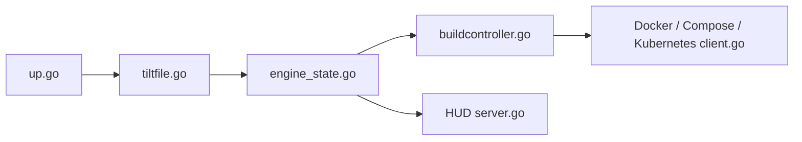

# tilt-dev/tilt

> Orchestrateur de développement local pour applications multi-services sur Kubernetes ou Docker Compose.

## Le problème
Entre un changement de code et un nouveau processus, il faut rebuild, redéployer et suivre les logs de nombreux services.

## Ce que ça fait vraiment
`tilt up` évalue un `Tiltfile`, surveille les fichiers, construit les images ou commandes, met à jour Kubernetes ou Compose et expose l'état et les logs dans un HUD web local.

## Comment c'est branché


## Essayer
```bash
curl -fsSL https://raw.githubusercontent.com/tilt-dev/tilt/master/scripts/install.sh | bash
tilt up
```

## Coût et pièges
Gratuit. Il faut un cluster ou Docker Compose. Installation par script piped to bash.

## Ce que ce n'est pas
Pas un outil de déploiement en production : le slogan dit « Kubernetes for Prod, Tilt for Dev ».

## Alternatives
Aucune alternative nommée dans le README.

## Pour toi
À surveiller : utile pour itérer sur des services d'inférence en local sur Kubernetes, sans intérêt si tu n'as pas de microservices.

