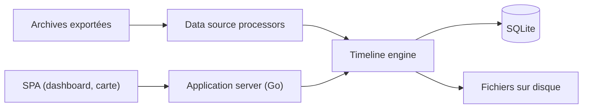

# timelinize/timelinize

> Application locale qui fusionne photos, messages, positions et comptes en une chronologie personnelle.

## Le problème
Les données d'une vie sont dispersées dans des services propriétaires qu'on peut perdre du jour au lendemain.

## Ce que ça fait vraiment
Importe archives d'export (Google Takeout, réseaux sociaux, messageries, GPX, contacts) sans décompression manuelle, les indexe dans SQLite et range les fichiers par date. Interface web avec vues chronologie, carte, galerie et conversations ; API HTTP symétrique à la CLI. Les imports répétés ignorent les doublons.

## Comment c'est branché


## Essayer
```bash
timelinize help
go run main.go help
```

## Coût et pièges
Gratuit, tout en local. Le schéma évolue : il faut recréer les chronologies à chaque mise à jour, et conserver les données sources d'origine.

## Ce que ce n'est pas
Pas un service cloud ni un outil stable : le README parle de développement actif et « instable ». Les captures d'écran sont en mode démo et périmées.

## Alternatives
- Aucune alternative citée dans le README.

## Pour toi
À surveiller : intéressant pour la souveraineté des données personnelles et l'ingestion multi-sources, mais trop instable pour t'y fier aujourd'hui.

